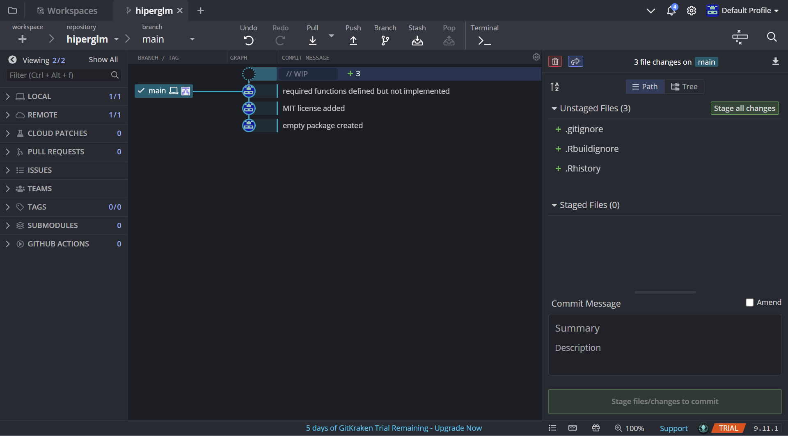

# Exercise 0: Setting up Git and Github

## Part 1: Command line interface 

Set up your Git and Github. 
You can find many resources regarding this online, including [a guide from Github](https://docs.github.com/en/get-started/quickstart/set-up-git).
Another nice one is Karl Broman's [minimal git/github tutorial](https://kbroman.org/github_tutorial/).
Make sure you at least set your Git username and commit email.

In this course, you will be mainly interacting with Git through its command-line interface. 
(In particular, I am not going to help you if you get yourself into trouble by using a Git GUI, like the RStudio one.)
If you are on Windows, you can use [Git Bash](https://www.atlassian.com/git/tutorials/git-bash). 
If you are on Mac, I recommend you use [iTerm2](https://iterm2.com/), instead of the built-in Terminal, along with [Oh My Zsh](https://ohmyz.sh/) and its [Powerlevel10k](https://github.com/romkatv/powerlevel10k) theme. 
If you are on Linux, most likely you don't need my suggestions :-)

Besides the bare minimum Git set-up, you should also set up the default editor and visual diff tool. 
I personally use Sublime Text as the Git editor on macOS and, for those on Windows, Notepad++ is one popular option. 
As for visual diff, I like [Meld](https://meldmerge.org/) but it is currently unavailable for latest macOS versions, unfortunately;
so I have been using [KDiff3](https://apps.kde.org/kdiff3/) instead.
The following commands tell Git to use Sublime and KDiff3:

```{bash, eval=FALSE}
git config --global core.editor subl --wait
git config --global diff.tool kdiff3
git config --global --add difftool.prompt false
```

All the above commands do is to simply modify the "global" `.gitconfig` file, typically located in your home directory. You can find the exact location of this file is via the command `git config --list --show-origin`. 

## Part 2: Graphical user interface

While I've just told you to use the command-line to interact with Git, a Git GUI can be a valuable tool for visually examining the current and past states of a repo.
So, my recommended workflow is to interact with Git via command-line (b/c it gives you more precise controls) but to use a GUI for visualizing the repo. 
I personally have been a happy user of a cross-platform [GitKraken](https://www.gitkraken.com/), the Pro version of which is freely available via [GitHub Student Developer Pack](https://education.github.com/pack/).
(Actually, the Free version should suffice for the purpose of this course;
but you need the Pro version for a Git repo with private remote.)
But other freeware like [Sourcetree](https://www.sourcetreeapp.com/) should work fine for the intended use of simply visualizing the repo. 

This part of the exercise used to be optional because it seems silly to micromanage peoples' workflows, but I have had many students not take my recommendation only to later tell me they wish they started using a Git GUI earlier.
So I am going to ask you to give it a try at least and to submit a screenshot of a package's Git history in Exercise 2.

## Things to commit and submit

The content of `.gitconfig` showing a proper Git set-up (though you would normally access this information via `git config` commands).

```{bash, eval=FALSE}
# Paste the output of `cat .gitconfig` here
[user]
	name = cindyfang70
	email = cindyfang70@gmail.com
```


# Exercise 1: Playing around with command-line and Git

## Part A

Log in to JHPCE and `srun --pty bash` to be assigned a compute node. 
For this exercise, we use the `homework/git_experiment` folder from the course repository, so clone the repo to your JHPCE home directory:

```{bash, eval=FALSE}
git clone https://github.com/aki-nishimura/stats-comp-algo-software-2024
```

Next, copy the `git_experiment` folder via a command `cp -r git_experiment git_experiment_copy` (`-r` for "recursive" copy that includes the folder's contents and sub-directories).
Go into the copied folder, initialize it as a git repo (yes, you can have a git repo within another git repo), and commit `foo.tex`:

```{bash, eval=FALSE}
git init
git add foo.tex
git commit -m "TeX file for experiment" 
```

Then try compiling the tex file via command-line, which can be done via:

```{bash, eval=FALSE}
module load tex
pdflatex foo.tex
``` 

You can suppress the compilation messages by redirecting the `stdout` to `/dev/null`:
```{bash, eval=FALSE}
pdflatex foo.tex > /dev/null
```

For the rest of this exercise, you use a "stream" editor _sed_. 
A stream editor processes a text file line-by-line, without ever loading the entire file into memory. 
This is useful when, for example, you are processing a massive text file containing data and you cannot load it to R with `read.table()`.
Using `sed` to edit a tex file is, obviously, an overkill and done here only for demonstration purposes.

The following command demonstrates how to add a line to a text file using `sed`: 

```{bash, eval=FALSE}
linenum=10
sed -i "$linenum i This is the first sentence." foo.tex
```

Check the change via `git diff`. After doing so, go ahead and add this change to the repo:

```{bash, eval=FALSE}
git add -u
git commit -m "Add first sentence to TeX file"
```

Now write a bash script which repeats the following cycle of steps for 9 times: adds a new sentence to `foo.tex` with `sed`, compile it, and commit *both* the TeX source file and its PDF output. 
I've provided starter code `edit_and_commit.sh` for this exercise. 
Once you have the bash script, execute it to make the 9 additional commits.
To sanity check that your script ran as expected, check the commit history via `git log` and check the changes made in the last commit via `git diff HEAD~1..`.
Then check the disk space usage of the `git_experiment_copy` folder. 
You can do this via `du -h -s git_experiment_copy` (`-h` for "human-readable" and `-s` for "summarize") or `du -h -s .` from inside the folder.

Next, make a fresh clone of the repo; you can remove the old one via `rm -rf stats-comp-algo-software-2024`.
And repeat the above process from the beginning, but without ever adding the PDF output to the repo.

**Tips:**
You can edit the bash script locally and transfer to JHPCE via `rsync -P git_experiment/edit_and_commit.sh your_username@jhpce03.jhsph.edu:/users/your_username/`.

**Question:** 
Does the size of the folder look reasonable relative to the sizes of the individual files inside it? 
(Use `ls -l -h` to list the files with the size info; `-l` is for "long.") 
If not, why would that be? 
Also, how do you explain the difference in the disk space usages under the two cases above?

**Your answer:** The size of the folder seems to be significantly larger than the individual files inside.
This may be because git is keeping track of changes to the file as well as metadata regarding the changes, whereas the sizes of the individual files only reflect their current state.

## Part B

You will now run the same experiment but on steroids, making a total of _10,000_ commits (plus the initial commit).
Start again with a fresh copy of the `git_experiment` folder and follow the same procedure as before.
This time, however, modify the bash script to make 9,999 additional commits and record the size of the `git_experiment_copy` folder after each commit.
You can use `du -s -k . >> git_repo_size_history.txt` for the latter purpose;
you may want to combine the `du` command with `awk '{print $1}'` to only record the size without extraneous information.
Since this is a long job that will take a non-trivial amount of JHPCE resource, just run this experiment once without committing the PDF output.
Also make sure to use `sbatch`, and _not_ `srun`, for such a long job.

**Tips:**
You can transfer the disk usage result from JHPCE to your local computer via 
`rsync -P "your_username@jhpce03.jhsph.edu:/users/your_username/stats-comp-algo-software-2024/homework/git_experiment_copy/git_repo_size_history.txt" git_experiment` (assuming that you are running the command from the `homework` folder).

**Question:** 
Plot the disk usage of the git repo with the number of commits on the $x$-axis.
Explain what you observe --- you may consult with resources on the web, including ChatGPT.
Based on this result and those from Part A, explain why [Github discourages you from commiting (large) binary files](https://docs.github.com/en/repositories/working-with-files/managing-large-files/about-large-files-on-github)?

**Your answer:** Based on the plot below, it appears that the size of the directory shows an overall linear increase as the number of commits increase, with some fluctuations. The initial size of the directory was 12K and the final size 323K, with `foo.tex` accounting for 224K. The fluctuations may be due to git running garbage collection behind the scenes. To further support this, for many of my 10,000 commits I received the message `Auto packing the repository in background for optimum performance. See "git help gc" for manual housekeeping.`
Similar to Part A, this is likely due to git tracking each change as well as metadata about the commits. 

Github likely discourages committing large binary files because as the file gets larger, git has to keep track of more information regarding the commits as well as the large file itself. This can be computationally expensive both when pushing to the cloud and for Github to store.

```{r, eval=FALSE}
source(file.path("..", "R", "colors.R"))

repo_size <- scan("git_experiment/git_repo_size_history.txt")
df <- as.data.frame(cbind(x=1:9999, y=repo_size))
plot(x=df$x, y=df$y,
  frame = FALSE, # Remove the ugly box
  col = jhu_color$heritageBlue,
  xlab = "Commit counts",
  ylab = "Repo size (MB)"
)
```

## Things to commit and submit

1. Completed `edit_and_commit.sh`
2. Answer to the question above, along with the plot


# Exercise 2: Setting up an R package skeleton

Set up your own version of the `hiperglm` package as we discussed in the class and put it up on your Github. The package set-up should have/include

* Proper R package structure; i.e. you can install it via `R CMD build/install`.
* MIT licence.
* Exported function `hiper_glm(design, outcome)` for model fitting.
* Exported S3 methods `coef`, `vcov`, and `print`.
* Clean and modular git history.

The goal here is to outline a skeleton of the package, without actually implementing the functions.
For now, let these "placeholder" functions simply throw warnings that they are yet to be implemented.

## Things to commit and submit

- Hyperlink to the `hiperglm` repository on your Github account
- Screenshot of the package's Git history visualized through a Git GUI of your choice

[hiperglm package](https://github.com/cindyfang70/hiperglm)



**Note:** 
In case you decided to go with GitKraken via GitHub Student Developer Pack, the student status verification process could take a few days.
In the meantime, however, you should be able to start using the free version without any problem and to later enter your Pro account credential after the verification is complete.