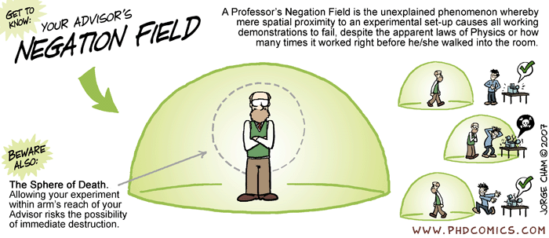

---
layout: true

# Brief hisotry of version control systems

---

Once programming became a thing, it wasn't long before people realized they need to do better than:

```{bash, eval=FALSE}
mess_version_1.R
mess_version_2.R
mess_version_3.R
...
first_draft.tex
first_draft_edited_by_advisorA.tex
first_draft_edited_by_advisorA_andB.tex
...
```

---

"Oh, the code was working right before our meeting!"

![:vspace 1em]


---

![:vspace 2em]


---

VCS's take snapshots of the folders/files in a codebase and keep records its states at various points in time.

--
* First gen (e.g. SCCS):&thinsp; local &mdash; file edits allowed by one user at a time

--
![:vspace .3ex]
* Second gen (e.g. SVN):&thinsp; centralized &mdash; single "official" version of codebase, commits require network access 

--
![:vspace .3ex]
* Third gen (e.g. Git):&thinsp; distributed &mdash; multiple versions of codebase coexist with partially shared history

<!-- SCCS = Source Code Control System -->
<!-- SVN = Subversion -->

---
layout: false

layout:true

# Brief foray into Git internals 

---

What the heck happens when you &nbsp;`git init`&thinsp;?

```{bash, eval=FALSE}
git_repo
├── .git
│   ├── HEAD
│   ├── config
│   ├── description
│   ├── hooks
│   │   └── ...
│   ├── info
│   │   └── exclude
│   ├── objects
│   │   ├── info
│   │   └── pack
│   └── refs
│       ├── heads
│       └── tags
```

---

It ain't as scary as it might look! 
For example, &thinsp;`config`&thinsp; is just a plain text file:

```{bash, eval=FALSE}
❯ cat config

[core]
	repositoryformatversion = 0
	filemode = true
	bare = false
	logallrefupdates = true
	ignorecase = true
	precomposeunicode = true
```

---

Ever wondered what kind of black magic the following commands unleash?

![:vspace -1ex]
```{bash, eval=FALSE}
❯ git config user.name 'Aki Nishimura'
❯ git config user.email 'aki.nishimura@jhu.edu'
```
![:vspace -.5ex]

--

Sorry to dissapoint, but nothing super exciting:
![:vspace -1ex]
```{bash, eval=FALSE}
❯ cat config

[core]
	repositoryformatversion = 0
	filemode = true
	bare = false
	logallrefupdates = true
	ignorecase = true
	precomposeunicode = true
[user]
	email = aki.nishimura@jhu.edu
```

---

Now, let's try committing some file:
![:vspace -1.5ex]
```{bash, eval=FALSE}
❯ echo 'Hello, World! -- Bar' >> bar.txt
❯ echo 'Hello, World! -- Foo' >> foo.txt
❯ cat bar.txt
Hello, World! -- Bar

❯ git commit -m 'Nonsense txt files just for demo'
[master (root-commit) e895331] Nonsense txt file just for demo
 1 file changed, 1 insertion(+)
 create mode 100644 bar.txt
 create mode 100644 foo.txt
```

---

Besides other minor changes, the above commands create:
![:vspace -1.5ex]
```{bash, eval=FALSE}
.git
├── ...
├── objects
│   ├── 22
│   │   └── 4b432523b07228787ff8e44fdf2d6d66c74b62
│   ├── 8a
│   │   └── b686eafeb1f44702738c8b0f24f2567c36da6d
│   ├── e8
│   │   └── 953312ce85c5f6f6ca007c20ac0e894d1350d3
│   ├── f6
│   │   └── e31e74619a2c9faafe04295a5ebed850c3b8d9
│   └── ...
└── ...
```
![:vspace -1.5ex]

---

Turns out &thinsp;`e8/95331...`&thinsp; is a compressed "commit" file:

![:vspace -1.5ex]
```{bash, eval=FALSE}
❯ git cat-file -p e895331 # -p for "pretty-print"

tree 224b432523b07228787ff8e44fdf2d6d66c74b62
author Aki Nishimura <aki.nishimura@jhu.edu> 1673124542 -0500
committer Aki Nishimura <aki.nishimura@jhu.edu> 1673124542 -0500

Nonsense txt files just for demo
```
![:vspace -1ex]

---

The file `22/4b432...` provides a snapshot of the repo at the time of the commit:

![:vspace -1.5ex]
```{bash, eval=FALSE}
❯ git cat-file -p 224b432
100644 blob f6e31e74619a2c9faafe04295a5ebed850c3b8d9	bar.txt
100644 blob 8ab686eafeb1f44702738c8b0f24f2567c36da6d	foo.txt
```
![:vspace -1ex]

--

The actual file contents are stored in the other two files:
<!-- blob = binary large object -->

![:vspace -1.5ex]
```{bash, eval=FALSE}
❯ git cat-file -p f6e31e7
Hello, World! -- Bar

❯ git cat-file -p 8ab686eafeb1f44702738c8b0f24f2567c36da6d
Hello, World! -- Foo
```

---

Let's try just one more commit:

![:vspace -1.5ex]
```{bash, eval=FALSE}
❯ echo 'Hello, again! -- Bar' >> bar.txt
❯ cat bar.txt
Hello, World! -- Bar
Hello, again! -- Bar

❯ git add -u # -u for "update"; same result as `git add bar.txt`
❯ git commit -m 'More nonsense'
[master 91953c1] More nonsense
 1 file changed, 1 insertion(+)
```

---

The above commit creates the folloing files:

![:vspace -1.5ex]
```{bash, eval=FALSE}
.git
├── ...
├── objects
│   ├── 7a
│   │   └── 09a0c41f79d572cfefc732f37e79375c6e7917
│   ├── ...
│   ├── 91
│   │   └── 953c1d8b829418b0ad976e803dcfdcb9d0aa64
│   ├── d6
│   │   └── 6fb3861381992a7f6a7a4f02050baea5472b4c
│   └── ...
└── ...
```

---

This time, the commit file includes info about the "parent": 

![:vspace -1.5ex]
```{bash, eval=FALSE}
❯ git cat-file -p 91953c1
tree 7a09a0c41f79d572cfefc732f37e79375c6e7917
parent 224b432523b07228787ff8e44fdf2d6d66c74b62
author Aki Nishimura <aki.nishimura@jhu.edu> 1673133419 -0500
committer Aki Nishimura <aki.nishimura@jhu.edu> 1673133419 -0500

More nonsense
```
![:vspace -.5ex]

-- 

Git knows not to make a new file for unchanged `foo.txt`:

![:vspace -1.5ex]
```{bash, eval=FALSE}
❯ git cat-file -p 7a09a0c
100644 blob d66fb3861381992a7f6a7a4f02050baea5472b4c	bar.txt
100644 blob 8ab686eafeb1f44702738c8b0f24f2567c36da6d	foo.txt

❯ git cat-file -p 224b432 # Previous snapshot
100644 blob f6e31e74619a2c9faafe04295a5ebed850c3b8d9	bar.txt
100644 blob 8ab686eafeb1f44702738c8b0f24f2567c36da6d	foo.txt
```

---
layout: false

# Acknowledgement

This lecture was inspired by a blog post

.center[
  [_Understanding git for real by exploring the .git directory_](https://www.daolf.com/posts/git-series-part-1/)
]

by Pierre de Wulf.
