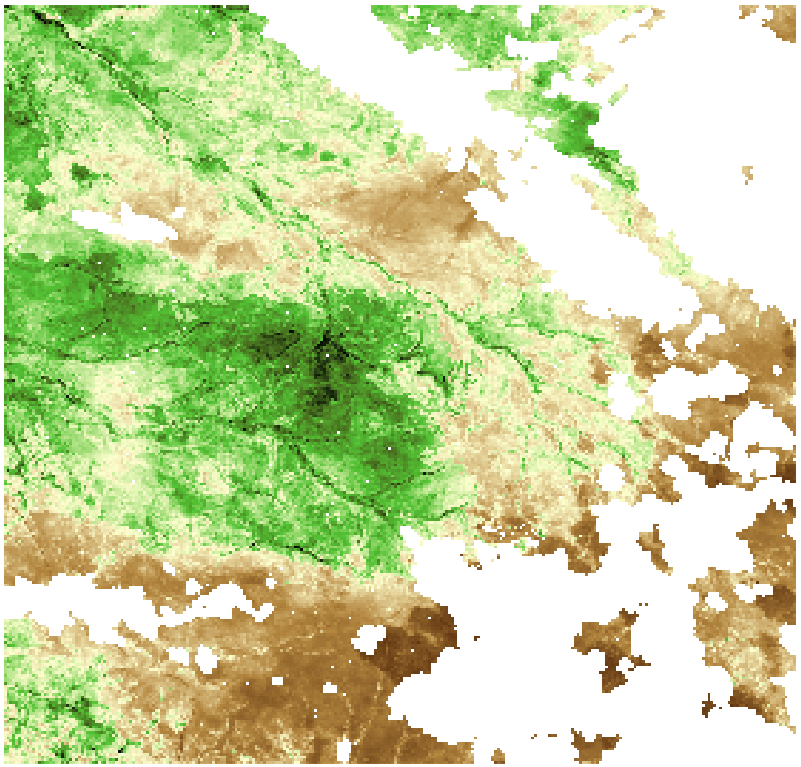

exclude: true

```{r setup, include = FALSE}
source(file.path("..", "R", "util.R"))
source(file.path("..", "R", "colors.R"))

required_packages <- c('MASS')
install_and_load_packages(required_packages)

# Print outputs without "##"
knitr::opts_chunk$set(comment = '')

# Show error message in red
knitr::knit_hooks$set(error = function(x, options) {
  paste0("<pre style=\"color: #DA0000;\"><code>", x, "</code></pre>")
    # reddish-color matching RStudio's
})

# Break error message at specified `linewidth`
error_hook <- knitr::knit_hooks$get("error")
knitr::knit_hooks$set(error = function(x, options) {
  if (!is.null(n <- options$linewidth)) {
    x = knitr:::split_lines(x)
    if (any(nchar(x) > n)) x = strwrap(x, width = n)
    x = paste(x, collapse = '\n')
  }
  error_hook(x, options)
})

options(digits = 3)
```

---

layout: true

# Floating point numbers
![:vspace -1ex]

### Example: 64-bits double-precision number

---


![:vspace -1ex]

52-bits fraction:<br>
$\qquad$ 10110... = 1/2 + 0/4 + 1/8 + 1/16 + 0/32 + ...

--

```{r, eval=TRUE}
c((1 + 2^(-52)) - 1, 
  (1 + 2^(-53)) - 1)
```

---


![:vspace -1ex]

11-bits exponent:<br>
$\qquad$ $2^{11} = 2048$, covering −1022 to +1023
![:vspace -.75ex]

--

```{r, eval=TRUE}
c(2^(1024), 2^(1023))
c(2^(-1023 - 52), 2^(-1022 - 52))
```

<!--
```{r, eval=TRUE}
c(2 * 2^(1023), (2 - 2^(-52)) * 2^(1023))
c(2^(-1022 - 52) / 2, 2^(-1022 - 52) / (2 - 2^(-52)))
```
This example is a bit of a surprise b/c `2^(-1022 - 52)` only has 1-binary digit of accuracy, so `2^(-1022 - 52) / (2 - 2^(-52)) == 2^(-1022 - 52)`.
-->

---

```{r}
.Machine$double.eps # == 2^-52 on most computers
```

```{r}
a <- 1e6 * rnorm(1)
a * (1 + .Machine$double.eps) == a
a * (1 + .Machine$double.eps / 2) == a
```

---

```{r}
set.seed(615)
a <- rnorm(1)
b <- rnorm(1)
c <- rnorm(1)
(a + b) + c == a + (b + c)
```

--

```{r}
set.seed(410)
a <- rnorm(1)
b <- rnorm(1)
c <- rnorm(1)
(a + b) + c == a + (b + c)
```

<!-- 
One consequence: non-determinism in GPU computation. 
This [2013 paper](https://doi.org/10.1145/2451116.2451118) reports 105% performance penalty from determinism. 
Examples of non-determinism in deep learning libraries can be found e.g.at [](https://pytorch.org/docs/stable/notes/randomness.html).
-->

---

```{r, eval=TRUE}
.Machine$double.xmax # == (2 - 2^-52) * 2^1023 on most computers
.Machine$double.xmax * (1 + .Machine$double.eps)
```

--

```{r, eval=TRUE}
log(.Machine$double.xmax)
c(exp(709), exp(710))
```

---
layout: false

layout: true

# Floating point numbers
![:vspace -1ex]

### Example: multinomial logit in double-precision

```{r, include=FALSE}
set.seed(1918)
```

```{r}
n_pred <- 10^6
n_category <- 3

x_1 <- rnorm(n_pred)
reg_coef <- matrix(
  rnorm(n_pred * n_category), 
  n_pred, n_category
)
```

---

---

![:vspace -3.1ex]
```{r, eval=FALSE}
category_logp <- as.vector(t(x_1) %*% reg_coef)
category_prob <- exp(category_logp) / sum(exp(category_logp))
```

---

![:vspace -3.1ex]
```{r}
category_logp <- as.vector(t(x_1) %*% reg_coef)
category_prob <- exp(category_logp) / sum(exp(category_logp))
category_prob
```

---

![:vspace -3.1ex]
```{r}
category_logp <- as.vector(t(x_1) %*% reg_coef)
category_prob <- exp(category_logp) / sum(exp(category_logp))
category_logp
```

---
layout: false

layout: true

# Floating point numbers
![:vspace -1ex]

### Example: multinomial logit in double-precision

---

How to deal with the numerical overflow? Note that

$$\frac{\exp(z_\ell)}{\sum_k \exp(z_k)} = \frac{\exp(z_{\ell} - a)}{\sum_k \exp(z_k - a)}$$
for any $a \in \mathbb{R}$. 

--

So the following does the right thing:
![:vspace -1ex]
```{r}
category_logp <- category_logp - max(category_logp)
category_prob <- exp(category_logp) / sum(exp(category_logp))
category_prob
```

---

More generally, most stats computations can be done in log-likelihood scales, where over/underflow is less likely.

--

Even when you need quantities in the original scale, often it is the ratio of likelihoods/probabilities that matters, e.g.

--

* Cluster assignment probability calculation in the EM algorithm for Gaussian mixture models. 
* Acceptance probability calculation in Metropolis-Hastings algorithm.

---
layout: false

layout: true

# Floating point numbers
![:vspace -1ex]

### Example: accuracy of numerical gradient

---

Numerical differentiation is another practical situation in which you clearly observe an effect of finite-precision.

--

Taylor's theorem tells us that
$$f(x + \Delta x) = f(x) + \Delta x f'(x) + \frac{(\Delta x)^2}{2} f''(x) + \ldots.$$

--

So we can approximate $f'(x)$ using the relation
$$\frac{f(x + \Delta x) - f(x)}{\Delta x} \approx f'(x) + O(\Delta x).$$
---

But we can do better; note that
.small[$$f(x + \Delta x) = f(x) + \Delta x f'(x) + \frac{(\Delta x)^2}{2} f''(x) + \frac{(\Delta x)^3}{6} f'''(x) + \ldots$$]
.small[$$f(x - \Delta x) = f(x) - \Delta x f'(x) + \frac{(\Delta x)^2}{2} f''(x) - \frac{(\Delta x)^3}{6} f'''(x) + \ldots$$]

--

So we have 
$$\frac{f(x + \Delta x) - f(x - \Delta x)}{2 \Delta x} \approx f'(x) + O((\Delta x)^2),$$
which is called _centered difference approximation_.

---

We can extend the idea to get higher-order estimates e.g.
.small[$$\frac{- f(x + 2 \Delta x) + 8 f(x + \Delta x) - 8 f(x - \Delta x) + f(x - 2 \Delta x)
  }{12 \Delta x} 
  = f'(x) + O((\Delta x)^4).$$]

--

BUT these methods aren't necessarily better in practice.
(You will find out why that might be in the homework.)

--

**Note:** For functions with multivariate inputs, we have 
$f(\boldsymbol{x} + \Delta x \, \boldsymbol{e}_i) = f(\boldsymbol{x}) + \Delta x \, \partial_i f(\boldsymbol{x}) + \ldots$.

<!-- More examples of floating point errors can be found at https://jvns.ca/blog/2023/01/13/examples-of-floating-point-problems/?utm_source=programmingdigest&utm_medium&utm_campaign=1500, including the issue with a naive one-pass algorithm for calculating variance (which can be remedied via Welford’s method). -->

---
layout: false
class: inverse, middle, center

# (ill)conditing and numerical (in)stability 

<div style="display:none">
$\DeclareMathOperator*{\argmax}{argmax}$
$\DeclareMathOperator*{\argmin}{argmin}$
</div>

---
layout: true

# What's ill-conditioning/num instability?

![:vspace -1ex]

### Example: regression with highly correlated predictors

![:vspace -.5ex]

---

<!-- 
```{r}
set.seed(140778)

n_obs <- 1000
n_pred <- 500
X <- matrix(0, nrow = n_obs, ncol = n_pred)

# Simulate binary design matrix
X[, 1] <- rbinom(n_obs, 1, prob = .5)
for (j in 2:n_pred) {
  # Take the (j - 1)th predictor & randomly flip two values
  X[, j] <- X[, j - 1]
  rand_indx <- sample.int(n_obs, 2)
  X[rand_indx, j] <- 1 - X[rand_indx, j]
}

eigval <- eigen(t(X) %*% X, only.values = T)$values 
```
-->

![:vspace -1ex]
```{r}
set.seed(140778)

n_obs <- 1000
n_pred <- 250
X <- matrix(0, nrow = n_obs, ncol = n_pred)

# Imagine individuals inheriting markers with random mutations.
ancestor_factor <- rbinom(n_pred, 1, prob = .1)
for (i in 1:n_obs) {
  X[i, ] <- ancestor_factor
  rand_indx <- sample.int(n_pred, 10)
  X[i, rand_indx] <- 1 - X[i, rand_indx]
}
```

---

Let's try predicting an outcome with this design matrix.
![:vspace -1ex]

```{r}
n_nonzero_pred <- 5
beta <- c(
  rep(1, n_nonzero_pred),
  rep(0, n_pred - n_nonzero_pred)
)
y <- X %*% beta + rnorm(n_obs)
```

--

![:vspace -3ex]

```{r, error=TRUE, linewidth=74}
lm_out <- lm(y ~ X, singular.ok = FALSE)
```

---

Model fit looks acceptable when allowing "singular":
![:vspace -1ex]

```{r, eval=FALSE}
lm_out <- lm(y ~ X)
coef(lm_out)[1:12]
```
```{r, echo=FALSE}
lm_out <- lm(y ~ X)
lm_coef <- coef(lm_out)
names(lm_coef)[1] <- "Intrcpt"

options(digits = 2)
lm_coef[1:6]
options(digits = 3)
lm_coef[7:12]
```

--

&hellip; except for one coef estimate being `NA`:
![:vspace -1ex]

```{r}
sum(is.na(coef(lm_out)))
```

---

Contrived? Oh, yes. But nothing wrong mathematically.
![:vspace -1ex]

```{r}
cor_mat <- cor(X)
cor_vec <- as.vector(
  cor_mat[lower.tri(cor_mat, diag = FALSE)]
)
abs_cor <- abs(cor_vec)
sort(abs_cor, decreasing = T)[1:10]
```

--

```{r}
pred_freq <- colMeans(X)
sort(pred_freq, decreasing = T)[1:10]
```

---

In practice, you might encounter num instability with:
* mixed-effect model, in which the "effective number of parameters" can exceed the number of observations.
* weighted regression, in which extreme weights can reduce the effective number of observations. 

---
layout: true 

# Example from spatial statistics: kriging

---

.pull-left[
  
]

.pull-right[

]

**Figure:** Satellite sensors can be used to estimate an amount of green vegetation but clouds cause missing data.
<!-- NDVI = normalized difference vegetation index. Can be e.g. used to quantify crop conditions in agriculture. -->

---

.pull-left[
  
]

.pull-right[
  
]

**Figure:** Satellite sensors can be used to estimate an amount of green vegetation but clouds cause missing data.

---

We'll consider a simplified example. 
Say we observe a function over a grid with "gap" and want to fill it in:

```{r, echo=FALSE}
sq_exp_cov <- function(dist, range) {
  return(exp(-(dist / range)^2))
}
```

```{r, echo=FALSE, fig.dim=c(8, 5), fig.retina=2, fig.align='center'}
loc_obs <- c(seq(0, .4, .01), seq(.6, 1, .01))
n_obs <- length(loc_obs)

set.seed(2021)
corr_range <- .2
dist_obs <- as.matrix(dist(loc_obs))
Sigma_obs <- sq_exp_cov(dist_obs, corr_range)
y_obs <- mvrnorm(mu = rep(0, n_obs), Sigma = Sigma_obs)
par(mar = c(4.1, 4.1, 0, 0))
plot(loc_obs, y_obs, xlab="s", ylab="y(s)", 
     cex=1.8, cex.lab=1.8, cex.axis=1.8, 
     col=jhu_color$spiritBlue, frame.plot = F)
```

<!--
How we simulated a function from a GP with squared exponential covariance in the previous plot:

```{r, eval=FALSE}
sq_exp_cov <- function(dist, range) {
  return(exp(-(dist / range)^2))
}

loc_obs <- c(seq(0, .4, .01), seq(.6, 1, .01))
n_obs <- length(loc_obs)

set.seed(2021)
corr_range <- .2
dist_obs <- as.matrix(dist(loc_obs))
Sigma_obs <- sq_exp_cov(dist_obs, corr_range)
y_obs <- mvrnorm(mu = rep(0, n_obs), Sigma = Sigma_obs)
plot(loc_obs, y_obs)
```
-->

---

Let $y(s_1), \ldots, y(s_n)$ denote the (potentially unobserved) values at location $s_1, \ldots, s_n$.

--

Kriging assumes $y(s_1), \ldots, y(s_n)$ to be distributed as Gaussian with mean $\mu(s_k)$ and covariance $k(s_k, s_\ell)$. 

--

The _covariance function_ $k(\cdot, \cdot)$ can be chosen e.g. as
![:vspace -.5ex]
$$k(s, s') = \sigma^2 \exp\left(- \frac{(s - s')^2}{2 r^2} \right)$$
![:vspace -.5ex]
where $r$ is a _range_ parameter.

**Interpretation:** Nearby observations are more correlated.
The range param controls how far correlation extends.

<!-- Matern covariance with smoothness $\nu = 5/2$: -->
<!-- $$k_{5/2}(r) = \left( -->
<!--   1 + \frac{\sqrt{5} r}{\ell} + \frac{5 r^2}{3 \ell^2}\right) \exp\left(- \frac{\sqrt{5} r}{\ell}  -->
<!-- \right)$$ -->
<!-- Eq (4.17) in Rasmussen and Williams. -->

<!-- matern_cov <- function(dist, range) { -->
<!--   scaled_dist <- dist / range -->
<!--   return( -->
<!--     (1 + sqrt(5) * scaled_dist + 5 / 3 * scaled_dist^2)  -->
<!--     * exp(- sqrt(5) * scaled_dist) -->
<!--   ) -->
<!-- } -->

---

Kriging then uses the fact that the cond distribution of 
$$\begin{bmatrix} \by_1 \\ \by_2 \end{bmatrix} 
  \sim \normalDist \left(
    \begin{bmatrix} \boldsymbol{\mu}_1 \\ \boldsymbol{\mu}_2 \end{bmatrix},
    \begin{bmatrix} \bSigma_{11} & \bSigma_{12} \\ 
    \bSigma_{21} & \bSigma_{22} \end{bmatrix}
  \right)$$
is given by
$$\by_1 \given \by_2
  \sim \normalDist\left( 
    \boldsymbol{\mu}_1 + \bSigma_{12} \bSigma_{22}^{-1} (\by_2 - \boldsymbol{\mu}_2),  
    \bSigma_{11} - \bSigma_{12} \bSigma_{22}^{-1} \bSigma_{21}
  \right).$$

---

Let's now try to interpolate the function:

![:vspace -1ex]

```{r}
#' Compute covariance from distance matrix
sq_exp_cov <- function(dist, range) {
  return(exp(-(dist / range)^2))
}
#' Compute the conditional mean of `y_1` given `y_2`
gauss_cond_mean <- function(y_2, mu_1, mu_2, cov_12, cov_22) {
  return(mu_1 + cov_12 %*% solve(cov_22, y_2 - mu_2))
}
```

--

![:vspace -2ex]
```{r}
loc_obs <- c(seq(0, .4, .01), seq(.6, 1, .01))
loc_new <- seq(.41, .59, .01)
n_obs <- length(loc_obs)
n_new <- length(loc_new)

dist_obs <- as.matrix(dist(loc_obs))
dist_new <- as.matrix(dist(loc_new))
cross_dist <- as.matrix(dist(c(loc_new, loc_obs)))
cross_dist <- cross_dist[1:n_new, (n_new + 1):(n_new + n_obs)]
```

---

Let's now try to interpolate the function:

![:vspace -1ex]

```{r}
mean_obs <- rep(0, n_obs)
mean_new <- rep(0, n_new)

corr_range <- .2
Sigma_obs <- sq_exp_cov(dist_obs, corr_range)
Sigma_new <- sq_exp_cov(dist_new, corr_range)
Sigma_cross <- sq_exp_cov(cross_dist, corr_range)
```

![:vspace -.5ex]

--

Ready, set, ...
![:vspace -1ex]

```{r, eval=FALSE}
y_predicted <- gauss_cond_mean(
  y_obs, mean_new, mean_obs, Sigma_cross, Sigma_obs
)
```

---

Let's now try to interpolate the function:
![:vspace -1ex]

```{r, eval=FALSE}
mean_obs <- rep(0, n_obs)
mean_new <- rep(0, n_new)

corr_range <- .2
Sigma_obs <- sq_exp_cov(dist_obs, corr_range)
Sigma_new <- sq_exp_cov(dist_new, corr_range)
Sigma_cross <- sq_exp_cov(cross_dist, corr_range)
```

![:vspace -.5ex]

Ready, set, ... go! (Oops.)
![:vspace -1ex]

```{r, error=TRUE, linewidth=70}
y_predicted <- gauss_cond_mean(
  y_obs, mean_new, mean_obs, Sigma_cross, Sigma_obs
)
```

---
layout: false

# Conditioning of problem

Think of a _problem_, machine implementation of which is an _algorithm_, as a map: $\, \bx \to \bf(\bx)$ &thinsp;(e.g. $\boldsymbol{x} \to \boldsymbol{A}^{-1} \boldsymbol{x}$).

--

**Question:** How sensitive is a problem $\bf(\bx)$ to small perturbation in the input $\bx$?

Measure of this sensitivity is called a _condition number_.

--

<p style="margin-top:4ex;"> </p>
## Example of why we might care about this:
* Say $\boldsymbol{x} + \boldsymbol{\delta x}$ is a machine representation of $\boldsymbol{x}$.
* How far away is $\boldsymbol{A}^{-1} (\boldsymbol{x} + \boldsymbol{\delta x})$ from $\boldsymbol{A}^{-1} \boldsymbol{x}$?

---

# Condition number

_(Relative) condition number_ is defined as

$$\kappa := \lim_{\| \bdelta \bx \| \to 0} \sup_{\bdelta \bx} 
\frac{
  \| \bf(\bx + \bdelta \bx) - \bf(\bx) \| / \| \bf(\bx) \|
  }{
  \| \bdelta \bx \| / \| \bx \|
},$$
where $\| \bx \| = \left( \sum_i x_i^2 \right)^{1/2}$ is the $\ell^2$-norm.  

--

We say a problem is _well-conditioned_ if $\kappa$ is small <br> (e.g. $\kappa \lesssim 10^2$) and _ill-conditioned_ if $\kappa$ large (e.g. $\kappa \gtrsim 10^6$).

--

In particular, when $\kappa \approx 10^{16} \approx (\text{machine prec})^{-1}$, <br> no algorithm can guarantee a meaningful result.

---

# Condition number

## Example of ill-conditioned problem: eigenvalues of non-symmetric matrices
Eigenvalues of
$\begin{bmatrix} 1 & 10^{16} \\ 0 & 1 \end{bmatrix}$ 
are {1, 1}. 

--

But those of $\begin{bmatrix} 1 & 10^{16} \\ 10^{-16} & 1 \end{bmatrix}$ are {0, 2}.

$\qquad$ (To see this, note that $\lambda_1 \lambda_2 = 0$ and $\lambda_1 + \lambda_2 = 2$.)

--

<p style="margin-top:3ex;">
On the other hands, the eigenvalues of a symmetric matrix are well-conditioned.
</p>

---
layout: true

# Condition number of a matrix

---

**Question:** What is the condition number of a matrix-vector multiplication $\bx \to \bA \bx$?

---

### Review: eigen/singular value decomposition 

<!-- TODO: Consider actually discussing SVD. -->
<!-- Also, Cholesky decomposition may be worth discussing given that we do explicitly use it every now and then. -->
<!-- And a bit of complexity analysis along with it could be useful to see it once. -->

--

Symmetric $\bA$ is _positive definite_ if $\bv^\intercal \bA \bv > 0$ for $\bv \neq \boldsymbol{0}$.

--

Any positive-definite $\bA$ admits the eigen decomposition
$$\boldsymbol{A} = \bm{U} \boldsymbol{\Lambda} \bm{U}^\intercal, \text{ where}$$
* $\bm{U}$ orthogonal, i.e. $\bm{U}^\intercal \bm{U} = \boldsymbol{I} \,$ or $\, \langle \bu_j, \bu_k \rangle = \ind\{ j = k \}$;
* $\boldsymbol{\Lambda} = \textrm{diag}(\lambda_1, \ldots, \lambda_p) \,$ for $\, \lambda_1 \geq \ldots \geq \lambda_p > 0$.

--

In particular,
$$
\bA \bu_j 
  = \bm{U} \boldsymbol{\Lambda} \bm{U}^\intercal\bu_j
  = \bm{U} \boldsymbol{\Lambda} \boldsymbol{e}_j
  = \lambda_j \bm{U} \boldsymbol{e}_j
  = \lambda_j \bu_j.
$$

---

### Review: eigen/singular value decomposition 

Since any vector $\bv$ can be expressed as $\bv = \sum_j \langle \bv, \bu_j \rangle \, \bu_j$,
$$\lambda_1 = \| \bA \bu_1 \| = \max_{\| \bv \| = 1} \| \bA \bv \|;$$

--

$$\lambda_p = \| \bA \bu_p \| = \min_{\| \bv \| = 1} \| \bA \bv \|.$$

--

In other words, $\lambda_1$ and $\lambda_p$ are the max amount of <br>dilation and contraction of vector under the map $\bv \to \bA \bv$.

---

### Review: eigen/singular value decomposition 

More generally, any $\bA \in \mathbb{R}^{n \times p}$ admits the singular value decomposition:
![:vspace -1.5ex]

$$
\bA = \bm{V} \boldsymbol{\Gamma} \bm{U}^\intercal, \text{ where}
$$

![:vspace -.5ex]
* $\bm{V} \in \mathbb{R}^{n \times p}$ and $\bm{U} \in \mathbb{R}^{p \times p}$ orthogonal;
* $\boldsymbol{\Gamma} = \textrm{diag}(\gamma_1, \ldots, \gamma_p) \,$ for $\, \gamma_1 \geq \ldots \geq \gamma_p \geq 0$.

--

**Note:** ![:vspace -.75ex]
* If $\bX = \bm{V} \boldsymbol{\Gamma} \bm{U}^\intercal$, then $\bX^\intercal \bX = \bm{U} \boldsymbol{\Gamma}^2 \bm{U}^\intercal$. 
--
("SVD on design matrix is equivalent to eigen on empirical cov.")

---

### Review: eigen/singular value decomposition 

The largest eigen/singular values of $\bA$ in particular cocides with its _matrix norm_:

$$\| \bA \| := \max_{\| \bv \| = 1} \| \bA \bv \| = \max_{\bv \neq \bm{0}} \frac{\| \bA \bv \|}{\| \bv \|} = \gamma_\max (\bA).$$

(It follows from the definition that $\| \bA \bv \| / \| \bv \| \leq \| \bA \|$.)

--

For invertable $\bA$, we have
$$\| \bA^{-1} \| = \gamma_\max (\bA^{-1}) = \gamma_\min^{-1} (\bA).$$

---

**Question:** What is the condition number of a matrix-vector multiplication $\bx \to \bA \bx$ by an invertible matrix?

**Recall:** The condition number is defined as:
$$\kappa := \lim_{\| \bdelta \bx \| \to 0} \sup_{\bdelta \bx} 
\frac{
  \| \bf(\bx + \bdelta \bx) - \bf(\bx) \| / \| \bf(\bx) \|
  }{
  \| \bdelta \bx \| / \| \bx \|
}.$$

<!-- TODO: Consider spending a bit more time explaining the matrix norm.  -->
<!-- Or, the condition number can be explained as the ratio of the greatest dilation and contraction of a vector by $\boldsymbol{A}$.  -->
<!-- (And we can then note that $\| \boldsymbol{A}^{-1} \| = 1 / | \boldsymbol{A} |$.) -->

--

<p style="margin-top:3ex;"> </p>
Now, let's study what happens under perturbation $\bdelta \bx$:
$$\hspace{-1.5em} \frac{
  \| \bA(\bx + \bdelta \bx) - \bA \bx \| / \| \bA \bx \|
  }{
  \| \bdelta \bx \| / \| \bx \|
} = \frac{
  \| \bA \bdelta \bx \| / \| \bdelta \bx \|
  }{
  \| \bA \bx \| / \| \bx \|
} \leq \| \bA \| \| \bA^{-1} \|.$$

<!-- The inequality follows from $\| \bA \bdelta \bx \| / \| \bdelta \bx \| \leq \| \bA \|$ and $\| \bx \| / \| \bA \bx \| = \| \bA^{-1} \bA \bx \| / \| \bA \bx \| \leq \| \bA^{-1} \|$.) -->

---

So we have shown that 
$$\kappa(\bx \to \bA \bx) \leq \| \bA \| \| \bA^{-1} \|.$$

--

$\| \bA \| \| \bA^{-1} \|$ turns out to be such a fundamental quantity in numerical linear algebra that we define
$$\kappa(\bA) := \| \bA \| \| \bA^{-1} \|.$$
--

![:vspace -2ex]
## Note:
* $\kappa(\bA) = \gamma_{\max}(\bA) / \gamma_{\min}(\bA)$, the ratio of the largest to "dilation factors" of the matvec operation $\bv \to \bA \bv$. 

<!-- **Question:** How accurate can $\bx = \bA^{-1} \boldsymbol{b}$ be? Or, to put it another way, what is \kappa(\bA^{-1})? -->

---

More generally for non-square $\bA \in \mathbb{R}^{n \times p}$ with $n \geq p$, the cond num can be defined in terms of the _pseudo-inverse_
![:vspace -.5ex]

$$\bA^+ = (\bA^\intercal \bA)^{-1} \bA^\intercal.$$

--

It's called as such because $\bA^+ \bm{b}$ is the "closest" thing to a (non-existent) solution " $\!\! \bA^{-1} \bm{b}\,$" of the problem " $\!\! \bA \bx = \bm{b} \,$":

![:vspace -.5ex]

$$\bA^+ \bm{b} = \argmin_{\bx} \| \bA \bx - \bm{b} \|^2.$$

![:vspace -1ex]

--

(If that didn't ring a bell, how about " $\!\! (\bX^\intercal \bX)^{-1} \bX^\intercal \by \,$"?)

--

The cond num in general is thus defined as

$$\kappa(\bx \to \bA \bx)
  = \kappa(\bA) := \| \bA \| \| \bA^+ \|
  = \gamma_{\max}(\bA) / \gamma_{\min}(\bA).$$

---
layout: false

# When matrix becomes ill-conditioned

Remember that malicious error?

![:vspace -1ex]

```{r, error=TRUE, linewidth=74}
lm_out <- lm(y ~ X, singular.ok = FALSE)
```

--

This is caused by the ill-conditioning in $\bX^\intercal \bX$ when trying to compute $\hat{\bm{\beta}} = (\bX^\intercal \bX)^{-1} \bX^\intercal \by$: 

```{r}
X_with_intrcpt <- cbind(rep(1, nrow(X)), X)
kappa(t(X_with_intrcpt) %*% X_with_intrcpt)
```

---

# When matrix becomes ill-conditioned

A similar story with the kriging example:

![:vspace -1ex]

```{r, error=TRUE, linewidth=70}
y_predicted <- gauss_cond_mean(
  y_obs, mean_new, mean_obs, Sigma_cross, Sigma_obs
)
```

--

The error occurs when when trying to invert $\bSigma_{22}$ for computing the conditional mean $\boldsymbol{\mu}_1 + \bSigma_{12} \bSigma_{22}^{-1} (\by_2 - \boldsymbol{\mu}_2)$:

```{r}
kappa(Sigma_obs)
```

---

# Accuracy of linear algebra algorithms

Good algorithms for solving ${\bA \bx = \boldsymbol{b}}$ for ${\bx}$  satisfy
$$\newcommand{\algOutputMarker}[1]{\widetilde{#1}}
  \frac{\| \algOutputMarker{\bx} - \bx \|}{\| \bx \|} \, = \mathcal{O}(\kappa(\bA) \epsilon_{\textrm{machine}})$$
where $\epsilon_{\textrm{machine}} \approx 10^{-16} \approx 2^{-52}$ (for most practical purposes).
<!-- See Section 13 of Trefethen for a precise definition of machine epsilon. -->

--

Similar (though not quite the same) results hold for algorithms to solve for the minimizer $\bx^*$ of $\| \bA \bx - \boldsymbol{b} \|^2$.

--

Such algorithms are called _stable_ &mdash; i.e. stable algorithms, if the problem is sufficiently well-conditioned, can compute a numerical solution close to the analytical one.

<!-- So, conditioning is a purely mathematical property of the problem and stability is a property of an algorithm. -->

---
class: inverse, middle, center

# Summary & References 

## Finite precision arithmetic & Numerical stability

---
layout: true

# Summary

---

Finite precision can cause an error when there is a perfectly fine mathematical/statistical answer.
<p style="margin-top: -1ex;"> </p>
* Don't stress for the first version, but figure it out and fix properly when errors arise. 
--
(No "hack" please.)

--

Magnitude of error in numerical linalg is typically proportional to $\kappa(\boldsymbol{A}) = \gamma_{\max}(\boldsymbol{A}) / \gamma_{\min}(\boldsymbol{A})$.
<p style="margin-top: -1ex;"> </p>
* Check it when getting an error. If huge, figure out why.

---

When we encounter an ill-conditioned problem, we need to figure out what would be a "statistically right" answer.

![:vspace -.5ex]
### Example: ill-conditioned regression
![:vspace -.75ex]
If a linear (mixed) model doesn't fit and $\kappa(\boldsymbol{X}^\intercal \boldsymbol{X})$ is huge, perhaps  you have more params than reliably estimable.

![:vspace -.5ex]
One potential solution here is to reduce an effective number of parameters via regularization; e.g. consider
--

![:vspace -.5ex]
$$\hat{\bm{\beta}} 
  = \left( \bX^\intercal \bX + \phi \bm{I} \right)^{-1} \bX^\intercal \by
  = \argmin_{\bm{\beta}} \left\{ \| \bX \bm{\beta} - \by \|^2 + \phi \| \bm{\beta} \|^2 \right\}$$
![:vspace -1.5ex]
instead of 
![:vspace -.5ex]
$$\hat{\bm{\beta}}_\textrm{mle} 
  = \left( \bX^\intercal \bX \right)^{-1} \bX^\intercal \by
  = \argmin_{\bm{\beta}} \| \bX \bm{\beta} - \by \|^2.$$

---

When we encounter an ill-conditioned problem, we need to figure out what would be a "statistically right" answer.

![:vspace -.5ex]

### Example: kriging for spatial interpolation
![:vspace -.75ex]

The cov matrix $\bSigma_{22}$ may not be (numerically) invertible but the cond mean $\boldsymbol{\mu}_1 + \bSigma_{12} \bSigma_{22}^{-1} (\by_2 - \boldsymbol{\mu}_2)$ is well-defined.
![:vspace -.5ex]

We just have to figure out how to compute it numerically.

--

(The eigen decomp provides a solution. Formally, it can be motivated by spectral analysis/Karhunen–Loève theorem.)

---
layout: false

# References

.center[
  
]