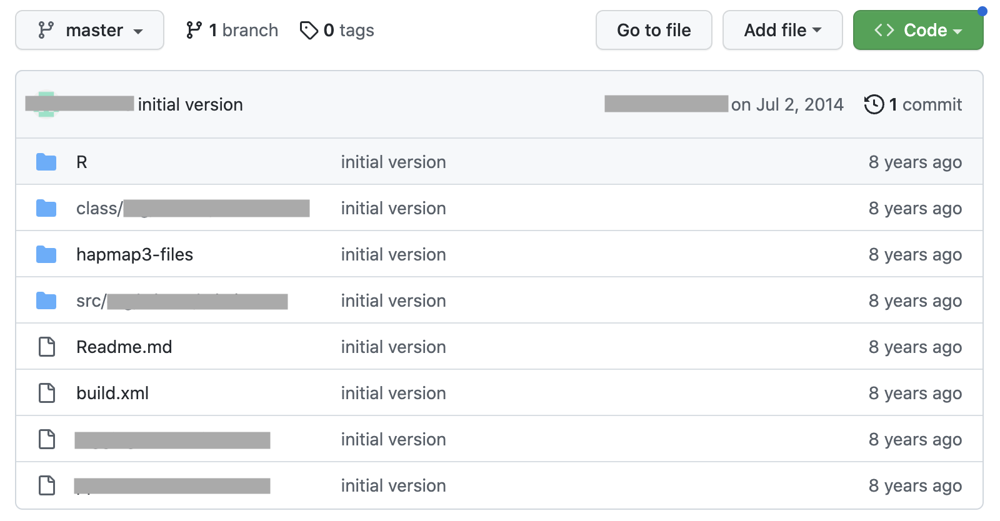
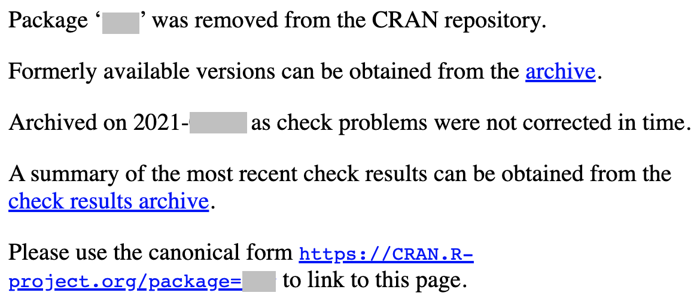
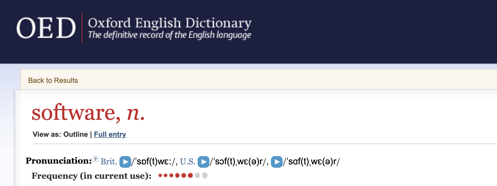
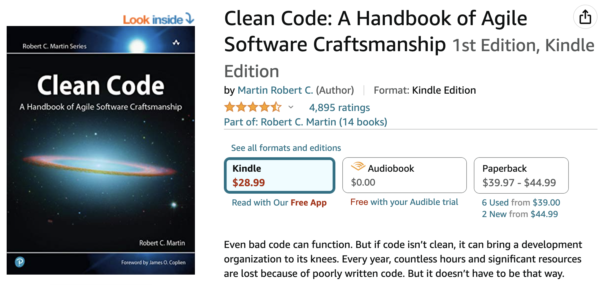
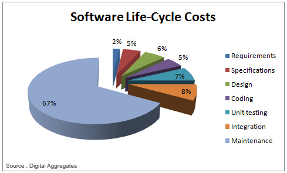
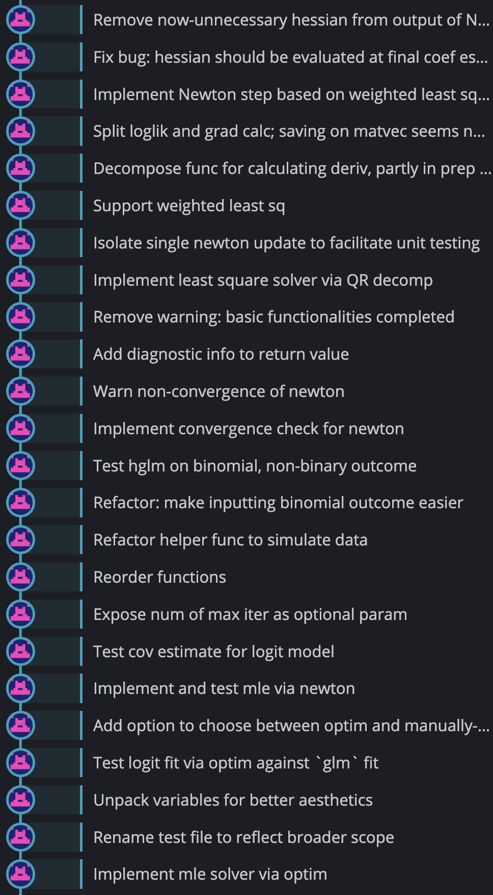
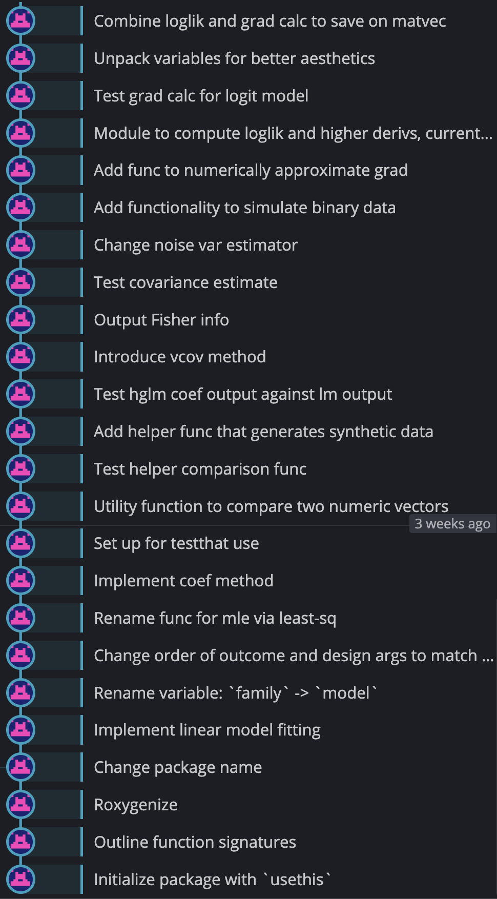

```{r setup, include = FALSE}
source(file.path("..", "R", "util.R"))

required_packages <- c('Matrix')
install_and_load_packages(required_packages)

# Print outputs without "##"
knitr::opts_chunk$set(comment = '')

# Show error message in red
knitr::knit_hooks$set(error = function(x, options) {
  paste0("<pre style=\"color: #DA0000;\"><code>", x, "</code></pre>")
    # reddish-color matching RStudio's
})
```

# Problems with stats software landscape

Here's what a prominent statistician calls "software":



---

# Problems with stats software landscape

Also classic&hellip; 

![:vspace 2em]


---

# What constitutes proper software?



--

1. _Academia._ ~~Mess~~ Code written by grad students to get results necessary for publishing and graduating. Often too messy for others to validate its output. (But who cares as long as the paper gets published.) Mostly of zero, and very occasionally of $\epsilon > 0$, utility to others.

---

```{css, echo=FALSE}
.float-parent-element { 
  width: 100%;
} 
.float-left-child-element { 
  float: left; 
  width: 32%; 
  margin-right: 1rem;
} 
.float-right-child-element {
  float: left; 
  width: 65%;
}
```

# What constitutes proper software?

![:vspace 1em]

<div class="float-parent-element">
  <div class="float-left-child-element">
    <p style="margin-top: 2.5rem">
    <b>Definition:</b> <br>
    <i>Bus factor</i> is the minimum number of team members who, if run over by a bus, would put the project in jeopardy.
    </p>
  </div>
  <div class="float-right-child-element">
    
  </div>
</div>

---

# What constitutes proper software?

![:vspace 1em]


---

# What constitutes proper software?

![:vspace 2.5em]


---

# What constitutes proper software?

![:vspace 1em]


---

# Problems with stats software landscape

How long does matrix multiplication take in base R

```{r, eval=FALSE}
n <- 4096L
A <- matrix(rnorm(n * n), nrow = n, ncol = n)
B <- matrix(rnorm(n * n), nrow = n, ncol = n)
system.time(A %*% B)
```

... as opposed to Anaconda Python?

```{python, eval=FALSE, python.reticulate=FALSE}
import numpy as np
n = 4096
A = np.random.randn(n, n)
B = np.random.randn(n, n)
%timeit A.dot(B)
```

---

# Problems with stats software landscape

```{r}
n_obs <- 5
n_pred <- 3
col_index <- c(1, 1, 1, 2, 2, 3)
row_index <- c(1, 3, 5, 2, 4, 1)
sparseMatrix(i = row_index, j = col_index, x = 1)
```

---

# Problems with stats software landscape

```{r}
n_obs <- 10^6
n_pred <- 10^4
density <- .01
n_nonzero <- as.integer(n_obs * n_pred * density)
```

```{r, eval=FALSE}
# Simulate sparse binary design matrix
row_index <- sample.int(n_obs, n_nonzero, replace = TRUE)
col_index <- sample.int(n_pred, n_nonzero, replace = TRUE)
X <- sparseMatrix(i = row_index, j = col_index, x = 1)
```

--
How much memory to store $X$ in dense format?

```{r}
memory_req_in_gb <- 8 * n_obs * n_pred / 1024^3
sprintf("Dense storage will require %.2gGB.", memory_req_in_gb)
```

---

# Problems with stats software landscape

```{r, eval=FALSE}
remotes::install_version("glmnet", version = "4.0.2") 
  # Released 2020-06-16
```

```{r, eval=FALSE}
# Simulate (completely random) survival time
failure_time <- rexp(n_obs)
censoring_time <- rexp(n_obs)
observed <- rbinom(n_obs, 1, prob = .7)
y <- data.frame(
  time = ifelse(observed, failure_time, censoring_time),
  status = observed
)
y <- as.matrix(y)
```

--

```{r generate_smaller_dataset_for_actual_evaluation, include=FALSE}
###
# This chunk generates a smaller dataset for the actual evaluation to save on execution time.
###
set.seed(615)

n_obs <- 100
n_pred <- 10
density <- .05
n_nonzero <- as.integer(n_obs * n_pred * density)

# Simulate sparse binary design matrix
row_index <- sample.int(n_obs, n_nonzero, replace = TRUE)
col_index <- sample.int(n_pred, n_nonzero, replace = TRUE)
X <- sparseMatrix(i = row_index, j = col_index, x = 1)

# Simulate (completely random) survival time
n_obs <- nrow(X)
failure_time <- rexp(n_obs)
censoring_time <- rexp(n_obs)
observed <- rbinom(n_obs, 1, prob = .7)
y <- data.frame(
  time = ifelse(observed, failure_time, censoring_time),
  status = observed
)
y <- as.matrix(y)
```

```{r, eval=FALSE}
glmnet::glmnet(X, y, family = 'cox')
```

```{r, echo=FALSE, error=TRUE}
# Directly produce the error message b/c it's nuisance (esp. when a fortran complier
# isn't included in Xcode) having to install an older ver of `glmnet` just for the error.
stop("Cox model mot implemented for sparse x in glmnet", call. = FALSE)
```

---

# Words from Joel Spolsky, <br> $\qquad$co-founder of Stack Overflow

"Nobody would be surprised if you told them it was hard to do open heart surgery. OK, fine, so maybe software isn't open heart surgery. But it has about the same number of moving parts, it's probably just as complicated, and it's critical in a different way.

But there's something weird about designing software specifically: Everybody thinks they know how to do it, even when they have no training. They just think, Oh sure, I can do that!"

<!-- https://www.salon.com/2004/12/09/spolsky/ -->

---
class: middle

![:vspace -1em]
# So, what's your point, dude?

Software is hard (but thanks Hadley for your help).

--

Computing is hard (can we have a Hadley here?).

--

Statisticians don't even know what they don't know.

--

Statisticians think: <br> 
&emsp; "I do statistics &mdash; let engineers write software." <br>
--
&emsp; "It works on small data, it should work on bigger one."

--

Statisticians have a role to play in the era of "Big Data" <br> 
but don't have skills necessary to directly contribute.

--

_We gotta start changing this._

---

# Thoughts behind the course design

![:vspace 2ex]

<!-- I wanted to address some of the misconception/confusions, which have been detrimental to the discipline, and actually teach statistical computing. -->

Misconception/confusions around "statistical computing":

--

![:vspace -.5ex]

* programming $=$ computing ? <!-- Computing: use of computers to solve mathematical equations. -->
--

* algorithms $=$ computing ? <!-- Computing involves practical implementations of algorithms. -->
--

![:vspace 3ex]

Most essential skill sets for our students?
<!-- (that are not being taught in our current curriculum) -->

--

![:vspace -.5ex]
$$
\begin{aligned}
&\hspace{-2.6em}\text{software dev} \\
  &\hspace{-1.5em}\geq \text{computing} \\
  &\geq \text{algorithm}.
\end{aligned}
$$

--

![:vspace 3ex]
$\Rightarrow$ Why not teach all these skills through developing <br> &emsp;&nbsp; a computationally-intensive statistical software?

<!-- (Additional benefits of this idea: many resources talk about effective software development, but often it's not obvious how to apply them to statistical software, especially computationally-oriented ones. And I get to share some of the best practices I have developed over years.) -->

---
layout: true

# Course contents and aims

---

Learning software dev tools (Git, Github, unix tools, etc) for real by actively using them throughout the course.

--

![:vspace 2ex]

Minimal intro to algorithms: ![:vspace -.5ex]
--

- Can't discuss their implementations w/o knowing a bit.
- Helps use existing packages more effectively.
- Provides foundation for further learning.

--

![:vspace 2ex]

Minimal intro to finite prec arithmetic & numerical issues: ![:vspace -.5ex]
--

- Numerical instabilities do arise in practice; <br> worth knowing what causes and how to avoid them.
- Essential for developers of computational software.

---

![:vspace 5ex]

How to optimize code for large-scale applicaitons: ![:vspace -.5ex]

--

* Learn when/what/how (not) to optimize. ![:vspace -.5ex]

--

  - Linking code to right software libralies
  - Introduciton to Rcpp
  - Parallelization opportunities (or lack thereof)

--

* Understand what affects code's performance, <br> rather than blindly reciting e.g. "C(++) is faster than R."

---

How to develop reliable and extensible software:

--

![:vspace -.75ex]
<div class="row">
  
  
  
</div>

