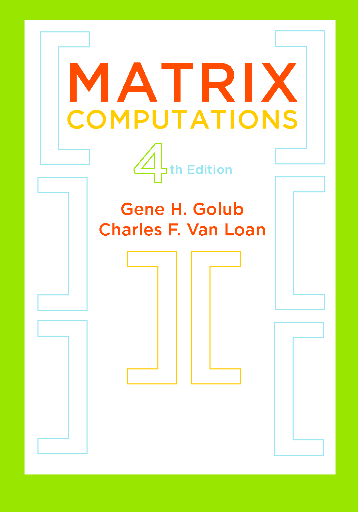

exclude: true

```{r setup, include = FALSE}
source(file.path("..", "R", "util.R"))
source(file.path("..", "R", "colors.R"))

required_packages <- c()
install_and_load_packages(required_packages)

# Print outputs without "##"
knitr::opts_chunk$set(comment = '')

options(digits = 2)
```

---

<style>
pre {
    display: block;
    font-family: monospace;
    font-size: 40px;
    white-space: pre;
    margin: 1em 0px;
    margin-top: 0em;
    margin-right: 0px;
    margin-bottom: 0em;
    margin-left: 0px;
}
</style>

<style type="text/css">
.remark-code { font-size: 50%; line-height: 1.35em; }
.remark-inline-code { font-size: 90%; }
</style>
<!-- https://github.com/yihui/xaringan/issues/69 -->

# What does "solve $\small Ax = b$ for $\small x$" mean?

--

Yes, mathematically it's just $\bA^{-1} \bm{b}$.

What you may not realize, though, is that solving a linear system **almost never** involves explicitly calculating $\bA^{-1}$.

--

In particular, please, pretty please, DON'T EVER do

```{r, eval=FALSE}
solve(A) %*% b
```

--

A more correct, though not necessarily optimal, way is

```{r, eval=FALSE}
solve(A, b)
```

--

While mathematically equivalent, we'll speak of "solving $\bA \bx = \bm{b}$" instead of "computing $\bA^{-1} \bm{b}$" to emphasize the pt.

---

# Solving $\small Ax = b$ via LU decomposition

Lower-upper (LU) decomp is one approach to solving $\bA \bx = \bm{b}$ and the one used by R.

--

LU decomp is essentially Gaussian elimination, but framed in a more formal set of linear algebra operations.

---
layout: true

# Solving $\small Ax = b$ via LU decomposition

![:vspace -.5ex]

### Review of Gaussian elimination
![:vspace -.75ex]

---

Let's say we want to solve a linear system with

$$\bA 
= 
\begin{bmatrix}
2 & 1 & 1 \\
4 & 3 & 3 \\
8 & 7 & 9 
\end{bmatrix}$$

---

In order to zero out the lower part of the first column, <br> we add multiples of the 1st row of $\bA$ to its 2nd and 3rd:

$$\begin{bmatrix}
2 & 1 & 1 \\
4 & 3 & 3 \\
8 & 7 & 9 
\end{bmatrix}
  \Rightarrow
\begin{bmatrix}
2 & 1 & 1 \\
0 & 1 & 1 \\
8 & 7 & 9 
\end{bmatrix}
  \Rightarrow
\begin{bmatrix}
2 & 1 & 1 \\
0 & 1 & 1 \\
0 & 3 & 5 
\end{bmatrix}$$

--

Repeat the drill to zero out the part of the second column:

$$\begin{bmatrix}
2 & 1 & 1 \\
0 & 1 & 1 \\
0 & 3 & 5 
\end{bmatrix}
  \Rightarrow
\begin{bmatrix}
2 & 1 & 1 \\
0 & 1 & 1 \\
0 & 0 & 2 
\end{bmatrix}$$

---

Now we observe that the process 

$$\begin{bmatrix}
2 & 1 & 1 \\
4 & 3 & 3 \\
8 & 7 & 9 
\end{bmatrix}
  \Rightarrow
\begin{bmatrix}
2 & 1 & 1 \\
0 & 1 & 1 \\
8 & 7 & 9 
\end{bmatrix}
  \Rightarrow
\begin{bmatrix}
2 & 1 & 1 \\
0 & 1 & 1 \\
0 & 3 & 5 
\end{bmatrix}$$

can be expressed as the matrix multiplication as follows:

$$\begin{bmatrix}
1 & 0 & 0 \\
-2 & 1 & 0 \\
-4 & 0 & 1 
\end{bmatrix}
\begin{bmatrix}
2 & 1 & 1 \\
4 & 3 & 3 \\
8 & 7 & 9 
\end{bmatrix}
  =
\begin{bmatrix}
2 & 1 & 1 \\
0 & 1 & 1 \\
0 & 3 & 5 
\end{bmatrix}$$

---

And the process

$$\begin{bmatrix}
2 & 1 & 1 \\
0 & 1 & 1 \\
0 & 3 & 5 
\end{bmatrix}
  \Rightarrow
\begin{bmatrix}
2 & 1 & 1 \\
0 & 1 & 1 \\
0 & 0 & 2 
\end{bmatrix}$$

can be expressed as:

$$\begin{bmatrix}
1 & 0 & 0 \\
0 & 1 & 0 \\
0 & -3 & 1 
\end{bmatrix}
\begin{bmatrix}
2 & 1 & 1 \\
0 & 1 & 1 \\
0 & 3 & 5 
\end{bmatrix}
  =
\begin{bmatrix}
2 & 1 & 1 \\
0 & 1 & 1 \\
0 & 0 & 2 
\end{bmatrix}$$

---
layout: false
layout: true

# Solving $\small Ax = b$ via LU decomposition

![:vspace -.5ex]

### "L" and "U" rise from Gaussian elimination
![:vspace -.75ex]

---

Putting them together, we have " $\! \bm{L}_2 \bm{L}_1 \bA = \bm{U} \!$ " as below

$$\begin{bmatrix}
1 & 0 & 0 \\
0 & 1 & 0 \\
0 & -3 & 1 
\end{bmatrix}
\begin{bmatrix}
1 & 0 & 0 \\
-2 & 1 & 0 \\
-4 & 0 & 1 
\end{bmatrix}
\begin{bmatrix}
2 & 1 & 1 \\
4 & 3 & 3 \\
8 & 7 & 9 
\end{bmatrix}
= \begin{bmatrix}
2 & 1 & 1 \\
0 & 1 & 1 \\
0 & 0 & 2 
\end{bmatrix}$$

--

and it turns out that
.pull-left[
$$\small \begin{bmatrix}
1 & 0 & 0 \\
0 & 1 & 0 \\
0 & -3 & 1 
\end{bmatrix}^{-1}
= \begin{bmatrix}
1 & 0 & 0 \\
0 & 1 & 0 \\
0 & 3 & 1 \end{bmatrix},$$
]

.pull-right[
$$\small \begin{bmatrix}
1 & 0 & 0 \\
-2 & 1 & 0 \\
-4 & 0 & 1 
\end{bmatrix}^{-1}
= \begin{bmatrix}
1 & 0 & 0 \\
2 & 1 & 0 \\
4 & 0 & 1 \end{bmatrix}.$$
]

---

Finally, we have " $\! \bA = \bm{L}_1^{-1} \bm{L}_2^{-1} \bm{U} \!$ " as below

$$\begin{bmatrix}
2 & 1 & 1 \\
4 & 3 & 3 \\
8 & 7 & 9 
\end{bmatrix}
= \begin{bmatrix}
1 & 0 & 0 \\
2 & 1 & 0 \\
4 & 0 & 1 
\end{bmatrix}
\begin{bmatrix}
1 & 0 & 0 \\
0 & 1 & 0 \\
0 & 3 & 1 
\end{bmatrix}
\begin{bmatrix}
2 & 1 & 1 \\
0 & 1 & 1 \\
0 & 0 & 2 
\end{bmatrix}$$

and 

$$\begin{bmatrix}
2 & 1 & 1 \\
4 & 3 & 3 \\
8 & 7 & 9 
\end{bmatrix}
= \begin{bmatrix}
1 & 0 & 0 \\
2 & 1 & 0 \\
4 & 3 & 1 
\end{bmatrix}
\begin{bmatrix}
2 & 1 & 1 \\
0 & 1 & 1 \\
0 & 0 & 2 
\end{bmatrix}.$$

---

```{r}
L <- rbind(
  c(1, 0, 0),
  c(2, 1, 0),
  c(4, 3, 1)
)
U <- rbind(
  c(2, 1, 1),
  c(0, 1, 1),
  c(0, 0, 2)
)
L %*% U
```


---

More generally, for $\bA \in \mathbb{R}^{p \times p}$, we can get

$$\bm{L}_n \ldots \bm{L}_2 \bm{L}_1 \bA = \bm{U}$$
where $\bm{L}_1^{-1} \bm{L}_2^{-1} \ldots \bm{L}_n^{-1}$ is easy to calculate and lower-tri. 

--

This gives rise to the _LU_ decomposition

$$\bA = \bm{L} \bm{U}.$$

---
layout: false
layout: true

# Solving $\small Ax = b$ via LU decomposition

![:vspace -.5ex]

### Got "L" and "U"?&thinsp; Time to back/forward-solve it. 
![:vspace -.75ex]

---

--

How do we solve $\bm{U} \bx = \bm{b}$ for $\bx$? Let's consider $3 \times 3$ case:

$$\begin{bmatrix}
u_{11} & u_{12} & u_{13} \\
0 & u_{22} & u_{23} \\
0 & 0 & u_{33}
\end{bmatrix}
\begin{bmatrix}
x_1 \\ x_2 \\ x_3
\end{bmatrix}
= \begin{bmatrix}
b_1 \\ b_2 \\ b_3
\end{bmatrix}$$

--

which equivalently is written as 

$$\begin{bmatrix}
u_{11} x_1 + u_{12} x_2 + u_{13} x_3 \\
\hphantom{u_{11} x_1 +} \ \, u_{22} x_2 + u_{23} x_3 \\
\hphantom{u_{11} x_1 + u_{12} x_2 +} \ \, u_{33} x_3
\end{bmatrix}
= \begin{bmatrix}
b_1 \\ b_2 \\ b_3
\end{bmatrix}.$$

--

So we got a system of 3 equations with 3 unknowns.

---

Let's solve them "backward" from the bottom one:

$$u_{33} x_3 = b_3 
\quad \Rightarrow \quad 
x_3 = b_3 / u_{33}.$$

--

Now that $x_3$ is known, we can solve $u_{22} x_2 + u_{23} x_3 = b_2$:

$$u_{22} x_2 + u_{23} x_3 = b_2
\quad \Rightarrow \quad 
x_2 = (b_2 - u_{23} x_3) / u_{22}.$$

--

Starting to see the pattern? Here goes the 3rd equation:

$$u_{11} x_1 + u_{12} x_2 + u_{13} x_3 = b_1
\ \Rightarrow \
x_1 = (b_1 - u_{12} x_2 - u_{13} x_3) / u_{11}.$$

---

More generally, for $\bm{U} \in \mathbb{R}^{p \times p}$, we have
$$\begin{aligned}
x_p &= b_p / u_{pp} \\
x_{p-1} &= (b_{p-1} - u_{p-1, p} \, x_p) / u_{p-1, p-1} \\
& \ \ \vdots
\end{aligned}$$

![:vspace -.75ex]
This procedure is called _back substitution_.

--

We can play the same trick to solve $\bm{L} \tilde{\bx} = \tilde{\bm{b}}$ and <br> the procedure is called _forward substitution_.

--

In R, `backsolve(U, b)` and `forwardsolve(L, b_til)`.

---
layout: false

# Solving $\small Ax = b$ via LU decomposition

To summarize, solving $\bA \bx = \bm{b}$ via LU decomp involves
1. computing the factorization $\bm{L} \bm{U} = \bA$,
2. back-solving for $\bm{L}^{-1} \bm{b}$, forward-solving for $\bm{U}^{-1} (\bm{L}^{-1} \bm{b}).$

--

**Notes:** 
* Actually, LU decomp is not stable on its own. 
* In practice, it is used with _pivoting_, which improves stability by appropriately permuting rows of $\bA$.

---

# Solving $\small Ax = b$ via LU decomposition

Some additional lessons from LU decomp:
* Triangular matrices make many calculations easy.
--

* While some luck is involved in $\bm{L} = \bm{L}_1^{-1} \bm{L}_2^{-1} \ldots \bm{L}_n^{-1}$ being so easy to calculate, more generally
  - Products and inverses of upper/lower-triangular matrices are again upper/lower-triangular.

---
layout: true

# Cholesky decomp for positive-def matrices
![:vspace .5ex]

---

_Cholesky decomp_ for sym. positive-definite matrices is among the most useful matrix factorizations in statistics.

--

Let's imagine applying the LU-like procedure to:

$$\begin{bmatrix}
1 & b & c & d \\
b & * & * & * \\
c & * & * & * \\
d & * & * & *
\end{bmatrix}$$

---

We zero out the 1st column entries as follows:
$$\begin{bmatrix}
1  & 0 & 0 & 0 \\
-b & 1 & 0 & 0 \\
-c & 0 & 1 & 0 \\
-d & 0 & 0 & 1
\end{bmatrix} \begin{bmatrix}
1 & b & c & d \\
b & * & * & * \\
c & * & * & * \\
d & * & * & *
\end{bmatrix} 
= \begin{bmatrix}
1 & b & c & d \\
0 & * & * & * \\
0 & * & * & * \\
0 & * & * & *
\end{bmatrix}.$$

--

By symmetry, we can also zero out the 1st row entries as

$$\begin{bmatrix}
1 & b & c & d \\
0 & * & * & * \\
0 & * & * & * \\
0 & * & * & *
\end{bmatrix} \begin{bmatrix}
1 & -b & -c & -d \\
0 & 1 & 0 & 0 \\
0 & 0 & 1 & 0 \\
0 & 0 & 0 & 1
\end{bmatrix}
= \begin{bmatrix}
1 & 0 & 0 & 0 \\
0 & * & * & * \\
0 & * & * & * \\
0 & * & * & *
\end{bmatrix}.$$

---

In other words, we got

$$\bm{L}_1 \begin{bmatrix}
1 & b & c & d \\
b & * & * & * \\
c & * & * & * \\
d & * & * & *
\end{bmatrix} \bm{L}_1^\intercal
= \begin{bmatrix}
1 & 0 & 0 & 0 \\
0 & * & * & * \\
0 & * & * & * \\
0 & * & * & *
\end{bmatrix}$$

for 

$$\bm{L}_1 
= \begin{bmatrix}
1  & 0 & 0 & 0 \\
-b & 1 & 0 & 0 \\
-c & 0 & 1 & 0 \\
-d & 0 & 0 & 1
\end{bmatrix}.$$

---

More generally, we have

$$\bm{L}_1 \begin{bmatrix}
a & b & c & d \\
b & * & * & * \\
c & * & * & * \\
d & * & * & *
\end{bmatrix} \bm{L}_1^\intercal
= \begin{bmatrix}
1 & 0 & 0 & 0 \\
0 & * & * & * \\
0 & * & * & * \\
0 & * & * & *
\end{bmatrix}$$

for 

$$\bm{L}_1 
= \begin{bmatrix}
 1 / \sqrt{a} & 0 & 0 & 0 \\
-b / \sqrt{a} & 1 & 0 & 0 \\
-c / \sqrt{a} & 0 & 1 & 0 \\
-d / \sqrt{a} & 0 & 0 & 1
\end{bmatrix}.$$

---

By continuing the process, we will have

$$\bm{L}_2 \begin{bmatrix}
1 & 0 & 0 & 0 \\
0 & * & * & * \\
0 & * & * & * \\
0 & * & * & *
\end{bmatrix} \bm{L}_2^\intercal
= \begin{bmatrix}
1 & 0 & 0 & 0 \\
0 & 1 & 0 & 0 \\
0 & 0 & * & * \\
0 & 0 & * & *
\end{bmatrix}$$

--

and, eventually, 
$$\bm{L}_3 \bm{L}_2 \bm{L}_1 
\bA
\bm{L}_1^\intercal \bm{L}_2^\intercal \bm{L}_3^\intercal
= \bm{I}.$$

--

In other words, 
$$\bA = \bm{L} \bm{L}^\intercal \text{ for } \bm{L} =  \bm{L}_1^{-1} \bm{L}_2^{-1} \bm{L}_3^{-1}.$$

---

We have essentially proven that any positive-def $\bA \in \mathbb{R}^{p \times p}$ admits a factorization $\bA = \bm{L} \bm{L}^\intercal$ for a lower-triangular $\bm{L}$.

--

But, how do we actually compute $\bm{L}$? 

---

Let's reverse-engineer:

$$\hspace{-2.5em}\begin{bmatrix}
\ell_{11} &  &  & \\
\ell_{21} & \ell_{22} &  &  \\
\ell_{31} & \ell_{32} & \ell_{33} &  \\
 & \vdots & & \ddots
\end{bmatrix} \begin{bmatrix}
\ell_{11} & \ell_{21} & \ell_{31} & \\
 & \ell_{22} & \ell_{32} & \ldots \\
 &  & \ell_{33} &  \\
 &  & & \ddots
\end{bmatrix} = \begin{bmatrix}
a_{11} & * & * &  \\
a_{21} & a_{22} & * & \ldots \\
a_{31} & a_{32} & a_{33} &  \\
 & \vdots &  & \ddots
\end{bmatrix}.$$

--

The above identity translates into the following equations:

$$\begin{aligned} 
\ell_{11}^2 &= a_{11} & \\
\ell_{21} \ell_{11} &= a_{21} 
  \! & \! \ell_{21}^2 + \ell_{22}^2 &= a_{22} \\
\ell_{31} \ell_{11} &= a_{31} 
  \! & \! \ell_{31} \ell_{21} + \ell_{32} \ell_{22} &= a_{32}
  \! & \! \ell_{31}^2 + \ell_{32}^2 + \ell_{33}^2 &= a_{33} \\ 
& & &\vdots
\end{aligned}$$

---

Here's how the algorithm looks like in code:

```{r, eval=F}
cholesky <- function(A) {
  L <- matrix(0, nrow = nrow(A), ncol=ncol(A))
  for (i in 1:nrow(A)) {
    for (j in 1:i) {
      sum <- 0
      for (k in seq_along(1:(j - 1))) {
        sum <- sum + L[i, k] * L[j, k]
      }
      if (j < i) {
        L[i, j] <- (A[i, j] - sum) / L[j, j]
      } else {
        L[i, i] <- sqrt(A[i, i] - sum)
      }}}
  return(L)
}
```

---

Here's how I'd re-write the previous code:

```{r}
cholesky <- function(A) {
  L <- matrix(0, nrow = nrow(A), ncol=ncol(A))
  for (row_indx in 1:nrow(A)) {
    A_sub <- A[1:row_indx, 1:row_indx, drop = FALSE]
    L[row_indx, 1:row_indx] <- 
      calc_chol_row(row_indx, A_sub, L)
  }
  return(L)
}

calc_chol_row <- function(i, A, L) {
  for (j in 1:i) {
    L[i, j] <- calc_chol_entry(i, j, A, L)
  }
  return(L[i, 1:i])
}
```

---

Here's how I'd re-write the previous code:

```{r}
calc_chol_entry <- function(i, j, A, L) {
  row_ij_inner_prod <- 0
  for (k in seq_len(j - 1)) {
    row_ij_inner_prod <- 
      row_ij_inner_prod + L[i, k] * L[j, k]
  }
  if (j < i) {
    chol_entry <- (A[i, j] - row_ij_inner_prod) / L[j, j]
  } else {
    chol_entry <- sqrt(A[i, i] - row_ij_inner_prod)
  }
  return(chol_entry)
}
```

---

This is even better:

```{r}
cholesky <- function(A) {
  L <- matrix(0, nrow = nrow(A), ncol=ncol(A))
  for (row_indx in 1:nrow(A)) {
    A_sub <- A[1:row_indx, 1:row_indx, drop = FALSE]
    L_prev <- L[1:(row_indx - 1), 1:(row_indx - 1), drop=F]
    L[row_indx, 1:row_indx] <- 
      calc_chol_row(row_indx, A_sub, L_prev)
  }
  return(L)
}
```

![:vspace -.7ex]

```{r}
calc_chol_row <- function(i, A, L_prev) {
  L_i <- rep(0, i) # the new "i"th row of L
  for (j in 1:i) {
    L_i[j] <- 
      calc_chol_entry(i, j, A, L_prev, L_i[1:(j - 1)])
  }
  return(L_i)
}
```

---

This is even better:

```{r}
calc_chol_entry <- function(i, j, A, L, L_i) {
  to_subtract <- 0
  if (j < i) {
    for (k in seq_len(j - 1)) {
      to_subtract <- to_subtract + L_i[k] * L[j, k]
    }
    chol_entry <- (A[i, j] - to_subtract) / L[j, j]
  } else {
    chol_entry <- sqrt(A[i, i] - sum(L_i^2))
  }
  return(chol_entry)
}
```

---

Let's see if the algorithm really works:

```{r}
set.seed(140778)
size <- 3
A <- rWishart(1, df = size + 2, Sigma = diag(size))
A <- drop(A)
L <- cholesky(A)
```

---

```{r}
A
L
```

--

```{r}
L %*% t(L)
```

---

If $\bA$ is positive-definite, you can solve $\bA \bx = \bm{L} \bm{L}^\intercal \bx = \bm{b}$ as:
![:vspace .75ex]

```{r}
b <- rnorm(size)

solve(A, b)
backsolve(t(L), forwardsolve(L, b))
```

--

![:vspace 1ex]

```{r}
backsolve(
  L, forwardsolve(L, b), 
  transpose = T, upper.tri = F
)
```

---

If $\bA$ is positive-definite, you can solve $\bA \bx = \bm{L} \bm{L}^\intercal \bx = \bm{b}$ as:
![:vspace .75ex]

```{r}
#' Solves Ax = b from the Cholesky factor L of A
chol_factor_solve <- function(L, b) {
  sol <- backsolve(
    L, forwardsolve(L, b), 
    transpose = T, upper.tri = F
  )
  return(sol)
}
```

---

Here's another use case of Cholesky:

```{r}
Sigma_inv <- A

L <- chol(Sigma_inv) # Use the built-in ver
z <- rnorm(size)
x <- forwardsolve(L, z)
```

--

What is the distribution of `x` above?

---
layout: false

# Stability of Cholesky decomp

**Theorem:** On computer with machine prec $\epsilon_\textrm{mach}$, the algorithm computes a Cholesky decomp $\bm{L}_\textrm{mach}$ such that 

$$\bm{L}_\textrm{mach} \bm{L}_\textrm{mach}^\intercal 
  = \bm{A} + \Delta \bm{A} 
  \ \text{ for } \
  \frac{\| \Delta \bm{A} \|}{\| \bm{A} \|} = O(\epsilon_\textrm{mach}).$$
  
--

**Theorem:** A numerical solution $\bx_\textrm{mach}$ of positive-definite $\bA \bx = \bm{b}$ via Cholesky satisfies

$$(\bm{A} + \Delta \bm{A}) \, \bx_\textrm{mach}
  = \bm{b} 
  \ \text{ for } \
  \frac{\| \Delta \bm{A} \|}{\| \bm{A} \|} = O(\epsilon_\textrm{mach}).$$
  
The above result in particular implies

$$\| \bx_\textrm{mach} - \bA^{-1} \bm{b} \| = O(\kappa(A) \epsilon_\textrm{mach}).$$

---
layout: true

# A bit of complexity analysis

---

Algorithms' (relative) speed depend on many factors: 
* Implementation details
* How the code got compiled
* Machine architecture
* &hellip;

--

Nonetheless, the number of floating point operations ("flops") is a useful metric of an algorithm's performance. 

--

In particular, it's reasonable to use the number of flops to assess how the performance depends on the problem size.

---

Let's start with simple one. What's the flop counts of

![:vspace -1ex]

$$\langle \bm{a}, \bm{b} \rangle 
  = \sum_{j = 1}^p a_j b_j
  = a_1 b_1 + \ldots + a_p b_p$$

![:vspace -1ex]

for $\bm{a}, \bm{b} \in \mathbb{R}^p$?

--

![:vspace 1ex]

Now what's the flop counts of $\bm{b} \to \bA \bm{b}$ for $\bA \in \mathbb{R}^{n \times p}$?

--

$$\bA \bm{b}
= \begin{bmatrix}
\bm{a}_{1,} \\
\hline
\hspace{2em} \vdots \hspace{2em} \\
\hline
\bm{a}_{n,}
\end{bmatrix} \bm{b}$$

---

And the flop counts of $\bA \bm{B}$ for $\bA \in \mathbb{R}^{n \times p}\!, \bm{B} \in \mathbb{R}^{p \times k} \,$?

--

$$\bA \bm{B} 
= \left[ \!
  \begin{array}{c|c|c}
  & \rule{0pt}{1em} & \\
  \bA \bm{b}_{,1} \, & \ \dots \ & \, \bA \bm{b}_{,k} \\
  & \rule{0pt}{1em} & 
  \end{array} 
\! \right]$$

--

Alternatively, we can view the matrix multiplication as

$$\hspace{-1em} \bA \bm{B} 
= \begin{bmatrix}
\bm{a}_{1,} \\
\hline
\hspace{2em} \vdots \hspace{2em} \\
\hline
\bm{a}_{n,}
\end{bmatrix} \begin{bmatrix}
\bm{b}_{,1} \, \Bigg| \dots \Bigg| \, \bm{b}_{,k} 
\end{bmatrix}
= \begin{bmatrix}
\bm{a}_{1,} \bm{b}_{,1} & \ldots & \bm{a}_{1,} \bm{b}_{,k} \\
\vdots & \ddots & \vdots \\
\bm{a}_{n,} \bm{b}_{,1} & \ldots &  \bm{a}_{n,} \bm{b}_{,k}
\end{bmatrix}.$$

---

Let's now think about implications in more stats contexts.

--

**Question:** What's the comp cost of generating a prediction from a multi-nomial logistic model? Assume that
* $n =$ the number of new data points,
* $p =$ the number of predictors,
* $k =$ the number of categories,

![:vspace -.5ex]

and both $n$ and $p$ are much larger than $k$.

---

The task involves computing 

![:vspace -1ex]

$$z_{i\ell} = \bx_i^\intercal \bm{\beta}_\ell
\ \, \text{ and then } \ \,
\pi_{i\ell} = \frac{ \exp{z_{i\ell}} }{ \sum_{\ell'} \exp{z_{i\ell'}} }$$

![:vspace -1ex]

for $i = 1, \ldots, n$ and $\ell = 1, \ldots, k$.

--

In matrix notations,

![:vspace -.5ex]

$$\bm{Z} = \bX \bm{B}
\ \, \text{ and then } \ \, 
\bm{\Pi} \propto \exp(\bm{Z})$$

![:vspace -.5ex]

for $\bX \in \mathbb{R}^{n \times p}$ and $\bm{B} = [\bm{\beta}_1 | \ldots | \bm{\beta}_k] \in \mathbb{R}^{p \times k}$.

---

As R code, it could look like

```{r, include=FALSE}
# Data to test the subsequent code chunks
n <- 32
p <- 4
k <- 3
X <- matrix(rnorm(n * p), nrow = n, ncol = p)
B <- matrix(rnorm(p * k), nrow = p, ncol = k)
```

```{r, eval=FALSE}
row_max <- function(A) { 
  sapply(1:nrow(A), function(i) max(A[i, ]))
}

rep_col <- function(x, ncol) {
  outer(x, rep(1, ncol))
}

Z <- X %*% B # O(npk); everything else O(nk)
Z <- Z - rep_col(row_max(Z), ncol(Z))
Pi <- exp(Z) 
Pi_rowsum <- rowSums(Pi) 
Pi <- rep_col(1 / Pi_rowsum, ncol(Pi)) * Pi 
```

---

Or, it could look like

```{r, eval=FALSE}
row_max <- function(A) { 
  sapply(1:nrow(A), function(i) max(A[i, ]))
}

rep_col <- function(x, ncol) {
  outer(x, rep(1, ncol))
}

category_logp <- X %*% B
n_cat <- ncol(category_logp)
category_logp <- 
  category_logp - rep_col(row_max(category_logp), n_cat)
category_prob <- exp(category_logp)
row_normalizer <- 1 / rowSums(category_prob)
row_normalizer <- rep_col(row_normalizer, n_cat)
category_prob <- row_normalizer * category_prob
```

---

**Question:** What's the comp cost of solving $\bA \bx = \bm{b}$ via Cholesky decomp and forward/back substitutions?

(You could e.g. use this to compute $(\bX^\intercal \bX)^{-1} \bX^\intercal \bm{y}$.)

--

![:vspace 2ex]

This entails two sub-questions: what are the costs of
1. computing the Cholesky decomposition $\bm{L} \bm{L}^\intercal = \bm{A}$?
2. subsequently computing $\bm{L}^{-\intercal} \bm{L}^{-1} \bm{b}$?

---

What's the cost of the Cholesky decomposition?
![:vspace .5ex]

```{r, eval=F}
cholesky <- function(A) {
  L <- matrix(0, nrow = nrow(A), ncol=ncol(A))
  for (i in 1:nrow(A)) {
    for (j in 1:i) {
      row_ij_inner_prod <- 0
      for (k in seq_along(1:(j - 1))) {
        row_ij_inner_prod <- 
          row_ij_inner_prod + L[i, k] * L[j, k]
      }
      if (j < i) {
        L[i, j] <- (A[i, j] - row_ij_inner_prod) / L[j, j]
      } else {
        L[i, i] <- sqrt(A[i, i] - row_ij_inner_prod)
      }}}
  return(L)
}
```

---

Let's first focus on the inner-most loop:
![:vspace .5ex]

```{r, eval=F}
      for (k in seq_along(1:(j - 1))) { 
        row_ij_inner_prod <- 
          row_ij_inner_prod + L[i, k] * L[j, k]
      }
      if (j < i) {
        L[i, j] <- (A[i, j] - row_ij_inner_prod) / L[j, j]
      } else {
        L[i, i] <- sqrt(A[i, i] - row_ij_inner_prod)
      }}}
```

--

The loop involves 

* $j - 1$ multiply, $\, j - 1$ add
* $1$ subtract, $\, 1$ sqrt or divide

![:vspace -.75ex]
for the total of $2j$ operations.

---

Now let's get a broader view:

```{r, eval=F}
cholesky <- function(A) {
  L <- matrix(0, nrow = nrow(A), ncol=ncol(A))
  for (i in 1:nrow(A)) {
    for (j in 1:i) {
      # 2j operations from inner-most loop
      }}
  return(L)
}
```

--

So the grand total number of operations is

.pull-left[
  $$\sum_{i = 1}^p \sum_{j = 1}^i 2j \hspace{-6em}$$
]

--

.pull-right[
  $$\hspace{-5em}\approx \sum_{i = 1}^p i^2 \approx \frac{1}{3} p^3.$$
]

<!-- The exact identities would be $\sum_{i = 1}^p i (i + 1)$ and $p (p + 1) (p + 2) / 3$. -->

---

Now, what's the cost of solving $\bm{L} \bm{z} = \bm{b}$ via forward sub?
![:vspace -1ex]

$$\begin{aligned}
z_1 &= b_1 / \ell_{11} \\[3pt]
z_2 &= (b_1 - \ell_{21} z_1) / \ell_{22} \\[-10pt]
&\hspace{1ex}\vdots \\[-10pt]
z_j &= (b_j - \textstyle \sum_{k = 1}^{j - 1} \ell_{jk} z_k) / \ell_{jj} \\[-10pt]
&\hspace{1ex}\vdots \\[-10pt]
z_p &= (b_p - \textstyle \sum_{k = 1}^{p - 1} \ell_{pk} z_k) / \ell_{pp}. 
\end{aligned}$$

--

Computing $z_j$ takes 
--
$j - 1$ multiply, $j - 1$ subtract, $1$ divide.

--

So the grand total comes to $\sum_{j = 1}^p 2 (j - 1) \approx p^2.$

--

The same cost for solving $\bm{L}^\intercal \bx = \bm{z}$ via backward sub.

---

So the overall cost of solving $\bA \bx = \bm{b}$ via Cholesky is 
$$\frac{1}{3} p^3 + 2 p^2 \sim \frac{1}{3} p^3 = O(p^3).$$
--

In particular, once the problem size $p$ becomes large enough, the costs of forward/back subs are negligible.

--

![:vspace 2ex]

**Q:** How does this compare to the cost of solving via LU?

--

* LU flop counts $\approx \frac{2}{3} p^3$
* Forward/back subs flop counts $\approx 2 p^2$

---
layout: false
layout: true

# QR decomp for minimizing $\small \| X \beta - y \|^2$

---

One way to solve a least-square prob is to use the pseudo-inv formula $(\bX^\intercal \bX)^{-1} \bX^\intercal \by$ with Cholesky decomp of $\bX^\intercal \bX$.

--

As we will see later, this is not necessarily the best way.

--


![:vspace 2ex]

_QR decomposition_ provides the standard approach to solving a least-square prob.

---

QR decomp of $\bX \in \mathbb{R}^{n \times p}$ for $n \geq p$ is given by

![:vspace -.5ex]

$$\bX = \bm{Q} \bm{R}$$

![:vspace -.5ex]

where $\bm{Q} \in \mathbb{R}^{n \times p}$ is orthogonal and $\bm{R} \in \mathbb{R}^{p \times p}$ upper-tri.

<!--
$$\begin{bmatrix}
* & * & * \\
* & * & * \\
* & * & * \\
* & * & * \end{bmatrix}$$
-->

--

![:vspace 1.5ex]

The nice thing about an orthogonal matrix is that it's easy to "invert,"
i.e. $\bm{Q}^\intercal \bm{Q} = \bm{I}_{p \times p}$.

--

![:vspace 1.5ex]

As a consequence, the decomp $\bX = \bm{Q} \bm{R}$ yields an identity

![:vspace -.5ex]

$$\bX^\intercal \bX = \bm{R}^\intercal \bm{Q}^\intercal \bm{Q} \bm{R} = \bm{R}^\intercal \bm{R},$$

![:vspace -.5ex]

--

which in turn yields

![:vspace -.5ex]

$$(\bX^\intercal \bX)^{-1} \bX^\intercal
  = \left(\bm{R}^\intercal \bm{R} \right)^{-1} \bm{R}^\intercal \bm{Q}^\intercal
  = \bm{R}^{-1} \bm{R}^{-\intercal} \bm{R}^\intercal \bm{Q}^\intercal 
  = \bm{R}^{-1} \bm{Q}^\intercal.$$

<!--
$$\begin{aligned}
(\bX^\intercal \bX)^{-1} \bX^\intercal
  &= \left(\bm{R}^\intercal \bm{Q}^\intercal \bm{Q} \bm{R} \right)^{-1} \bm{R}^\intercal \bm{Q}^\intercal  \\
  &= \left(\bm{R}^\intercal \bm{R} \right)^{-1} \bm{R}^\intercal \bm{Q}^\intercal \\
  &= \bm{R}^{-1} \bm{R}^{-\intercal} \bm{R}^\intercal \bm{Q}^\intercal \\
  &= \bm{R}^{-1} \bm{Q}^\intercal
\end{aligned}$$
-->

---

In other words, once we have the $\bm{Q}\bm{R}$ decomp of $\bX$, <br>
we can compute the solution $\hat{\bm{\beta}} = (\bX^\intercal \bX)^{-1} \bX^\intercal \by$ as

![:vspace -.5ex]

$$\hat{\bm{\beta}} = \bm{R}^{-1} \bm{Q}^\intercal \by.$$

--

Some important facts in computing the QR decomp:
* If $\bm{Q}_1$ and $\bm{Q}_2$ are orthogonal, then so is the prod $\bm{Q}_2 \bm{Q}_1$: 

--

![:vspace -.5ex]

$$(\bm{Q}_2 \bm{Q}_1)^\intercal \bm{Q}_2 \bm{Q}_1 = \bm{Q}_1^\intercal \bm{Q}_2^\intercal \bm{Q}_2 \bm{Q}_1 = \bm{I}.$$ 

![:vspace -.5ex]

--

* If $\bm{Q}$ is orthogonal, then so is $\bm{Q}^\intercal$. 
(Because $\bm{Q} \bm{Q}^\intercal = \bm{I}$.)
--

* If $\bm{Q} = [\, \bm{q}_1 \, | \ldots | \, \bm{q}_n \,] \in \mathbb{R}^{n \times n}$ is orthog, then a "reduced" matrix $\bm{Q}_{n \times p} = [\, \bm{q}_1 \, | \ldots | \, \bm{q}_p \,]$ satisfies $\bm{Q}_{n \times p}^\intercal \bm{Q}_{n \times p} = \bm{I}_{p \times p}$.

---

Householder realized we can construct an orthogonal matrix $\bm{Q}_1 \left(= \bm{I} - 2 \bu_1 \bu_1^\intercal\right) \in \mathbb{R}^{n \times n}$ such that

$$\bm{Q}_1 \bX
  = \bm{Q}_1 \begin{bmatrix} * & * & * \\ * & * & * \\ * & * & * \\ * & * & * \\ * & * & * \end{bmatrix}
  = \begin{bmatrix} * & * & * \\ 0 & * & * \\ 0 & * & * \\ 0 & * & * \\ 0 & * & * \end{bmatrix}.$$
  
(Taking $\bX \in \mathbb{R}^{5 \times 3}$ in the visual illustration above.)

---

Similarly, we can construct orthogonal matrices $\bm{Q}_j \left(= \bm{I} - 2 \bu_j \bu_j^\intercal\right) \in \mathbb{R}^{n \times n}$ for $j = 1, \ldots, p$ such that

$$\bm{Q}_3 \bm{Q}_2 \begin{bmatrix} * & * & * \\ 0 & * & * \\ 0 & * & * \\ 0 & * & * \\ 0 & * & * \end{bmatrix}
  = \bm{Q}_3 \begin{bmatrix} * & * & * \\ 0 & * & * \\ 0 & 0 & * \\ 0 & 0 & * \\ 0 & 0 & * \end{bmatrix}
  = \begin{bmatrix} * & * & * \\ 0 & * & * \\ 0 & 0 & * \\ 0 & 0 & 0 \\ 0 & 0 & 0 \end{bmatrix}.$$
  
--

In other words, for $\bX \in \mathbb{R}^{n \times p}$,

$$\bm{Q}_p \ldots \bm{Q}_1 \bX = \bm{R}_{n \times p}.$$

---

For $\bm{Q}_{n \times n} = (\bm{Q}_p \ldots \bm{Q}_1)^{-1}$, we can express the relation as

$$\bX = \bm{Q}_{n \times n} \bm{R}_{n \times p}.$$

--

For the $\bX \in \mathbb{R}^{5 \times 3}$ case,
$$\bX =
  \left[ \! 
    \begin{array}{c|c|c|c|c} 
    & & \rule{0pt}{1.7em} & & \\ 
    \! \bm{q}_1 & \bm{q}_2 & \bm{q}_3 & \bm{q}_4 & \bm{q}_5 \\ 
    & \rule{0pt}{2.1em} & 
  \end{array} \! \right]
  \begin{bmatrix} * & * & * \\ 0 & * & * \\ 0 & 0 & * \\ 0 & 0 & 0 \\ 0 & 0 & 0 \end{bmatrix}.$$

--

The last $n - p$ columns of $\bm{Q}_{n \times n}$ and $n - p$ rows of $\bm{R}_{n \times p}$ contributes nothing, so we can drop them. 

---

![:vspace -.5ex]

Now we obtain the decomposition in the desired form:

![:vspace -.5ex]

$$\bX = \bm{Q} \bm{R} = \bm{Q}_{n \times p} \bm{R}_{p \times p}.$$

![:vspace -1.5ex]

--

**Notes:**

* Note analogy with LU decomp &mdash; applying a seq of transformations, whose prod has the same structure.
--

* Computing the $\bm{Q}^\intercal \by = \bm{Q}_p \ldots \bm{Q}_1 \by$ part of $\hat{\bm{\beta}} = \bm{R}^{-1} \bm{Q}^\intercal \by$ in practice can be done via matvecs $\bv \to (\bm{I} - 2 \bu_j \bu_j^\intercal ) \, \bv$.
--

  * Most obvious in concept may _not_ be most efficient in implementation.
  * Some operations are best abstracted away and done implicitly &mdash;
  e.g. `qr()` returns a `qr` class with associated S3 methods.
  
---

Computational complexity of solving least-sq via QR?

* Cost of computing $\bm{R}$ via $\bm{Q}_p \ldots \bm{Q}_1$ $\, \sim \, 2 n p^2 - \frac{2}{3} p^3$

--

![:vspace -1ex]
* Cost of $\by \to \bm{Q}^\intercal \by$ $\, \sim \, 4np - 2 p^2$
<!-- I could find a reference and had to count by hand, so there could be a minor mistake. -->

--

* Cost of back-sub $\bm{Q}^\intercal \by \to \bm{R}^{-1} \bm{Q}^\intercal \by$ $\, \sim \, p^2$

--

Overall, the factorization part dominates with $2 n p^2$ cost. 

--

The $- \frac{2}{3} p^3$ part reduces the cost a bit, but only when $n \approx p$.
* If $n = p$, then $2 n p^2 - \frac{2}{3} p^3 = \frac{4}{3} p^3$.
* If $n = 4p$, then $2 n p^2 - \frac{2}{3} p^3 = \left( 8 - \frac{2}{3} \right) p^3$.

<!-- 
See Trefethen Algorithm 10.2:
2 (n - j) for inner prod, (n - j) multiply, (n - j) add for j = 1, \ldots, p, for the grand total of $4np - 2 p^2$?
-->
  
---
layout: false

# Stability of least-sq via Householder QR

<!--
See Eq (18.4) & (18.5) and Theorem 18.1 of Trefethen. 

In our notation, we have $\bA = \bX$, $\bx = \bm{\beta}$, $\bm{b} = \by$, and 

$$\cos(\theta) = \frac{\| \bX \bm{\beta} \|}{\| \bm{b} \|}, \
\tan(\theta) = \frac{\| \bX \bm{\beta} - \by \|}{\| \bX \bm{\beta} \|}, \
\eta = \frac{\| \bX \| \| \bm{\beta} \|}{\| \bX \bm{\beta} \|}.$$
-->

Rel. error in numerically computing $\hat{\boldsymbol{\beta}}$ has the order

$$\left[ \kappa(\boldsymbol{X}) + \frac{\| \boldsymbol{X} \hat{\boldsymbol{\beta}} - \boldsymbol{y} \|}{\| \boldsymbol{X} \hat{\boldsymbol{\beta}} \|} \kappa^2(\boldsymbol{X})
  \right] \epsilon_{\textrm{mach}}.$$
  
<!--
$$\left[
  \left( 1 + \frac{\| \by \|}{\| \bX \| \| \hat{\boldsymbol{\beta}} \| } \right) \kappa(\boldsymbol{X}) + \frac{\| \boldsymbol{X} \hat{\boldsymbol{\beta}} - \boldsymbol{y} \|}{\| \boldsymbol{X} \hat{\boldsymbol{\beta}} \|} \kappa^2(\boldsymbol{X})
  \right] \epsilon_{\textrm{mach}}.$$
  
The term $\frac{\| \by \|}{\| \bX \| \| \hat{\boldsymbol{\beta}} \| }$ comes from a potential perturbation in $\by$.
-->

Note the $\kappa^2(\boldsymbol{X})$ term contribution is small if $\| \boldsymbol{X} \hat{\boldsymbol{\beta}} - \boldsymbol{y} \|$ is.

--

![:vspace 1.5ex]
On the other hand, using the formula $\hat{\boldsymbol{\beta}} = (\bX^\intercal \bX)^{-1} \bX^\intercal \by$ and solving $\bX^\intercal \bX = \bX^\intercal \by$ leads to an error of the order

$$\kappa(\bX^\intercal \bX) \epsilon_{\textrm{mach}} = \kappa^2(\bX) \epsilon_{\textrm{mach}}.$$

---
class: inverse, middle, center

# Summary & References 

## Minimal intro to numerical linear algebra

---
layout: true

# Summary

![:vspace -.5ex]

### Various decompositions and their use cases

![:vspace -.5ex]

---

We've covered the basic ideas and structures behind<br> three numerical linear algebra algorithms:
* LU decomp $\bA = \bm{L} \bm{U}$ for square $\bA \in \mathbb{R}^{p \times p}$
* Cholesky decomp $\bA = \bm{L} \bm{L}^\intercal$ for positive-definite $\bA$
* QR decomp for rectangular $\bA \in \mathbb{R}^{n \times p}$

--

You can often get faster, more numerically accurate results by explicitly choosing appropriate algorithms.

---

Cholesky decomp has many use cases in stats computing:
* Solving systems involving (inverse) cov matrices
* Generating multi. Gaussian r.v.'s with given $\bm{\Sigma}$ or $\bm{\Sigma}^{-1}$

--
* Computing the (log-) determinant of $\bm{\Sigma}$ or $\bm{\Sigma}^{-1}$

--
* Note QR decomp of $\bX$ gives Cholesky decomp of $\bX^\intercal \bX$: 
  ![:vspace -.5ex]
  $$\bX = \bm{Q} \bm{R} \ \Rightarrow \ \bX^\intercal \bX = \bm{R}^\intercal \bm{R}$$
  
---

QR decomp is the standard approach for least-sq probs.

--

* If $\bX$ is sparse, there is _LSQR_ for minimizing $\| \bX \bm{\beta} - \by \|^2.$
--

* Fun fact: QR decomp plays a key role in eigen decomp.

--

Remember also that QR decomp is typically calculated implicitly;
don't be dissapointed with the lack of $\bm{Q}, \bm{R}$.

--

Incidentally, this kind of implicit representations of mathematical operations are common in computing. <br>
(e.g. `RcppEigen` operations often do _not_ return matrices.)

---
layout: false

# Summary

![:vspace -.5ex]

### Computational complexity

![:vspace -.5ex]

--

Complexity analysis tells us how an algorithm's performance depends on problem sizes. 

--

Matrix decomp and related tasks (solving a linear system, least-sq, etc) often require $O(n p^2)$ operations when $n \geq p$.

--

This means, if $n$ and $p$ get 10 times larger, computational time gets _1,000_ times larger.

--

Approaches that work for small to medium problems don't necessarily work for large problem. 

---

# Summary

![:vspace -.5ex]

### Numerical stability and accuracy

![:vspace -.5ex]

Two algorithms, whose answers are mathematically equiv, can yield completely different numerical answers.

--

![:vspace 1ex]

Avoid &nbsp;`beta_hat <- solve(t(X) %*% X, t(X) %*% y)`
because it guarantees error of order $\kappa(\boldsymbol{X}^\intercal \boldsymbol{X}) = \kappa^2(\boldsymbol{X})$.

--

![:vspace 1ex]

And please, pretty please, DON'T EVER do
```{r, eval=FALSE}
XTX_inverse <- solve(t(X) %*% X)
beta_hat <- XTX_inverse %*% (t(X) %*% y)
```

---

# References

.pull-left[
  
]

.pull-right[
  ![:vspace 1.4ex]
  
]

