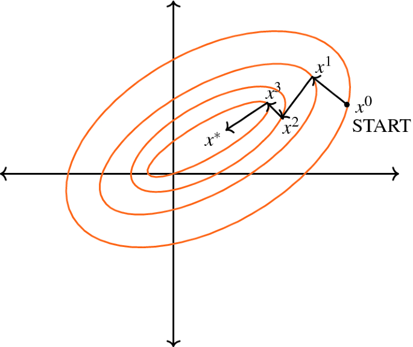
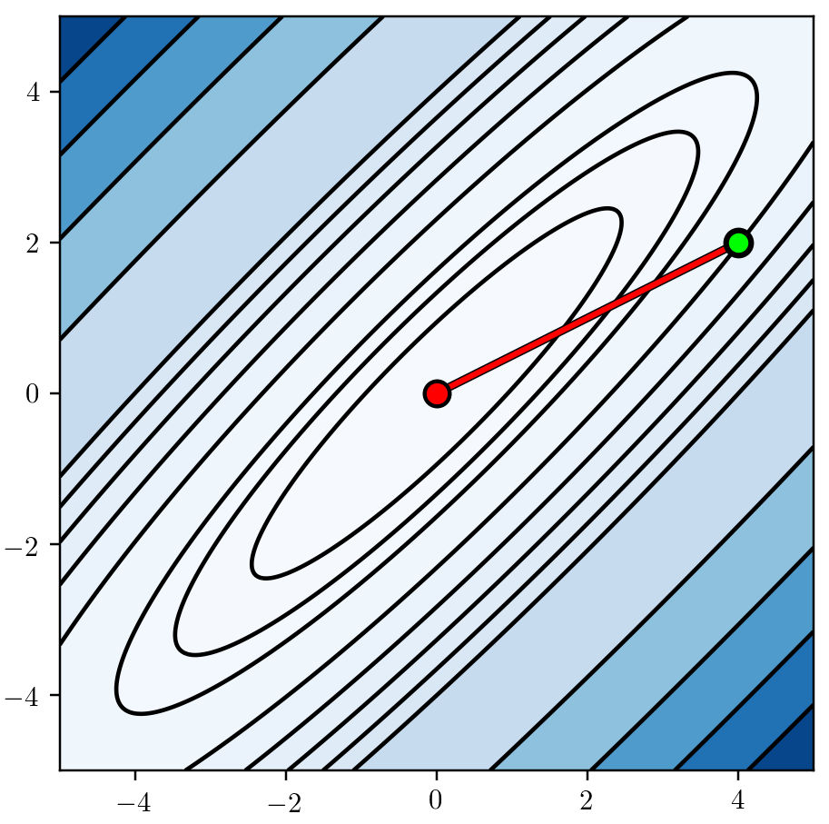
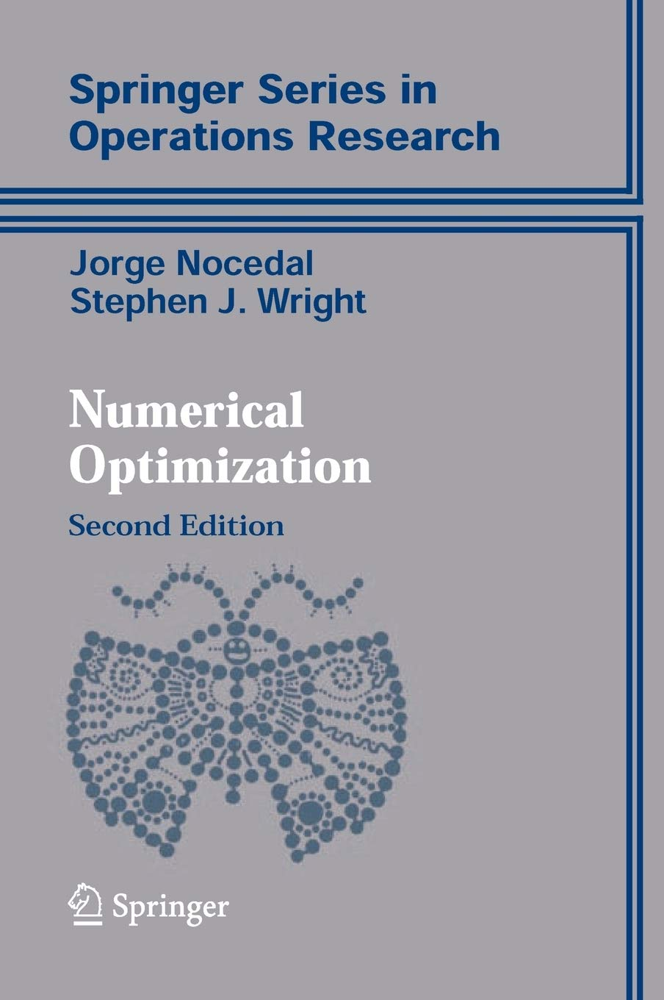

exclude: true

```{r setup, include = FALSE}
# Print outputs without "##"
knitr::opts_chunk$set(comment = '')
```

---

<script type="text/x-mathjax-config">
MathJax.Hub.Config({
  TeX: {
    Macros: {
      searchDirec: "{\\boldsymbol{u}}",
      stepsize: "{s}",
      currState: "{\\bx}",
      nextState: "{\\bx_\\textrm{next}}",
      hess: "{\\boldsymbol{H}}"
    }
  }
});
</script>

# Numerical optimization of utility/loss func

**Problem:** 
Find a minimizer $\bx^*$ of _objective_ function $f(\bx)$.<br>
$\hphantom{\textbf{Problem:}}$(Think $\bx^* = \hat{\boldsymbol{\theta}}_\textrm{mle}$ and $f(\boldsymbol{\theta}) = - \log L(\by \given \boldsymbol{\theta})$.)

--

This is typically done iteratively:

1. Given the current estimate $\currState$, search for $\nextState$ so that 
$$f(\nextState) < f(\currState).$$
2. Set $\currState \gets \nextState$ and repeat until convergence.

--

![:vspace 3ex]
**Question:** How to pick $\nextState$?

---

# Searching for next state along a line

Let $\searchDirec \ (\| \searchDirec \| = 1)$ be a search direction and $\stepsize > 0$ a stepsize:
$$\nextState = \currState + \stepsize \searchDirec.$$

--

To determine appropriate $\searchDirec$ and $\stepsize$, we observe 
$$
\begin{aligned}
f(\nextState) 
  &= f(\currState + s \searchDirec) \\
  &\approx f(\currState) + s \left. \frac{\textrm{d}}{\textrm{d} t} f(\currState + t \searchDirec) \right|_{t = 0} \\
  &= f(\currState) + s \left\langle \nabla f(\currState), \searchDirec \right\rangle.
\end{aligned}
$$

--

For $f(\nextState) < f(\currState)$, we want $\left\langle \nabla f(\currState), \searchDirec \right\rangle < 0$. 
--
In fact, the last quantity is minimized when $\searchDirec = - \nabla f(\currState) / \| \nabla f(\currState) \|$.

---
layout: true

# Gradient descent algorithm

---

In other words, for small stepsize $\stepsize$, the direction $\searchDirec =$ $- \nabla f(\currState) / \| \nabla f(\currState) \|$ provides the greatest decrease in $f(\cdot)$.

--

Based on this observation, the _gradient descent_ searches for a suitable $\nextState$ along the line
$$\{ \currState - s' \nabla f(\currState) : s' > 0 \}.$$

--

The ideal stepsize choice would be
$$\DeclareMathOperator*{\argmin}{argmin} 
\stepsize = \argmin_{s' > 0} f\big(\currState - s' \nabla f(\currState)\big),$$
![:vspace -1ex]

--

but that's asking too much; in practice, we just ensure $f(\nextState)$ achieves a sufficient decrease from $f(\currState)$.

---

![:vspace 3ex]


---

What is the caveat with the motivating calculation?

--

![:vspace -1ex]
&emsp;&mdash; the 1st-order approx:  $f(\nextState) \approx f(\currState) + s \left\langle \nabla f(\currState), \searchDirec \right\rangle$

The gradient only provides a locally optimal direction!

--

**Question:** Other worthy directions to search for $\nextState$?

---
layout: false

layout: true

# Newton's method

---

The 1st-order approx of $f(\nextState) = f(\currState + s \searchDirec)$ motivated the gradient descent. 
Let's now try the 2nd-order approx.

--

This time we write $\nextState = \currState + \Delta \bx$ and observe that
![:vspace -.5ex]
$$f(\nextState) \approx f(\currState) + \left\langle \nabla f(\currState), \Delta \bx \right\rangle + \frac{1}{2} \Delta \bx^\intercal \hess_f(\currState) \Delta \bx,$$
![:vspace -1ex]
where $\left(\hess_f \right)_{ij} = \displaystyle \frac{\partial^2 f}{\partial x_i \partial x_j}$ denotes the Hessian of $f$.

--

The right-hand side is quadratic in $\Delta \bx$.
By completing the square, we find its minimum to be achieved when:
![:vspace -.5ex]
$$\Delta \bx = - \hess_f(\bx)^{-1} \nabla f(\bx).$$

---

Newton's method thus sets&thinsp; $\nextState = \currState - \hess_f(\bx)^{-1} \nabla f(\bx)$. <br>
--
And we don't need to choose a stepsize!

--

**Alternative motivation:**

If $\nextState = \bx + \Delta \bx$ were to achieve a minimum, then we would have $\nabla f(\nextState) = \boldsymbol{0}$. 

--

Taylor's approx would then give us
![:vspace -.5ex]
$$\boldsymbol{0} = \nabla f(\bx + \Delta \bx) \approx \nabla f(\bx) + \hess_f(\bx) \Delta \bx.$$

--

Pretending " $\hspace{-.55ex}\approx$" to be " $\hspace{-.55ex}=$", solving the above equation yields $\Delta \bx = - \hess_f(\bx)^{-1} \nabla f(\bx)$.

---



---
layout: false

layout: true

# Newton's method vs. Gradient descent

---

Let's compare the two in terms of their _convergence rates_, i.e. how quickly the iterates reach a minimizer $\bx^*$.

--

To this end, we assume:
* $f(\cdot)$ is _strongly convex_, i.e. the smallest eigenvalue of $\hess_f$ is bounded below by $m > 0$;
* the starting point $\currState$ is "close enough" to $\bx^*$.

--

We will then have the following results (which ignore all the gory technical details).

---

**Gradient descent:** For some $c$ and $r < 1$,
$$| f(\nextState) - f(\bx^*)| \leq c \,| f(\currState) - f(\bx^*) |$$
$$\| \nextState - \bx^* \| \leq r \, \| \currState - \bx^* \|.$$

--

**Newton's method:** For some $C$ and $R$,
$$| f(\nextState) - f(\bx^*)| \leq C \, | f(\currState) - f(\bx^*) |^2$$
$$\| \nextState - \bx^* \| \leq R \, \| \currState - \bx^* \|^2.$$
--

In other words, the gradient descent converges _linearly_ while Newton's method converges _quadratically_.

---

layout: false

# Quasi-Newton methods

Newton's method converges faster theoretically; however, calculating $\hess_f$ and, especially, inverting it can be costly.

--

A _quasi-Newton method_ replaces $\hess_f$ with a cheaper approx $\boldsymbol{G}_f$, searching for a next state along the line
![:vspace -1ex]
$$\left\{ \currState - \stepsize \, \boldsymbol{G}_f^{-1} \nabla f(\currState) : s > 0 \right\}.$$

--

The approx $\boldsymbol{G}_f$ generally depends on not only $\currState$ but on all the previously visit states and gradients evaluated there. 
--


_BFGS_ algorithm is the most well-known and is widely available as a black-box optimizer.
<!-- BFGS = Broyden–Fletcher–Goldfarb–Shanno -->

---
layout: true

# Nitty-gritty details of optimization

---

Newton's method can be sensitive to initialization, so variants make it more robust e.g. by adding line search.

![:vspace -1.2ex]

&emsp; (Not much of an issue for fitting GLMs)

--

<style>
ul { margin-top: -.5ex; }
ul li { margin-bottom: 1ex; }
li:first-child { margin-top: 1ex; }
</style>

How do we choose a stepsize?
- Take a guess and pray to a god. 
--
(jk!)
- Make sure it is neither 
  1. so small that you don't get anywhere, nor 
  2. so large that the gradient info becomes useless. <br>

--

![:vspace -.5ex]
&emsp; (_Wolfe conditions_ achieves the above desiderata, but ...)

![:vspace -.5ex]
- Let an existing software implementation take care of it.

---

When do we stop the iterations (other than eyballing it)?

--

To identify potential stopping criteria, let's think about the behavior of an optimization algorithm at/near $\bx^*$:
--

* $\nabla f(\bx^*) = \boldsymbol{0}$,&thinsp; so stop when $\| \nabla f(\currState) \| \leq \epsilon_\textrm{tol}\!$ ?
--

* $\nextState = \currState$ if $\currState = \bx^*$,&thinsp; so $\| \nextState - \currState \| \leq \epsilon_\textrm{tol}\!$ ?
--

* $f(\nextState) = f(\currState)$ if $\currState = \bx^*$,&thinsp; so $| f(\nextState) - f(\currState) | \leq \epsilon_\textrm{tol}\!$ ?

--

First option most common in textbooks, but the third one more common and intuitive in statistical applications.

--

How about $\epsilon_\textrm{tol}$? Let the domain expertise guide it!

---
layout: false

# Application to logistic regression

--

![:vspace 10ex]

> You are smart, you'll figure it out. 
<p style="margin-left: 11em; margin-top: -1ex;"> &mdash; Marc Suchard </p>

![:vspace 8ex]


--

That said, here is a tip to simplify some of the formulas and hence their implementations &mdash;
if $g(\bm{\beta}) = f(\bm{X} \bm{\beta})$, then 
$$\nabla g(\bm{\beta}) = \bm{X}^\intercal \nabla f(\bm{X} \bm{\beta})
  \ \text{ and } \
  \hess_g(\bm{\beta}) = \bm{X}^\intercal \left[ \hess_f(\bm{X} \bm{\beta}) \right] \bm{X}.$$

---

# References

.pull-left[
  
]

--

.pull-right[
  
]

